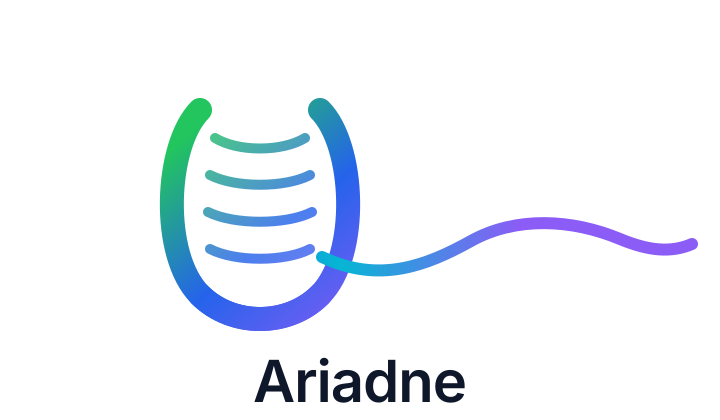

# Ariadne AI Workflow Platform

<p align="center">
  
</p>

## Overview

Ariadne AI Workflow Platform は、AI Agent が複雑なworkflow迷宮を迷わず進むためのContext First型AI workflow repositoryです。

アリアドネの糸が迷宮を消すのではなく、迷宮を歩く者の帰還を助けたように、このplatformはDispatcher、Context、RAG、Evidence、Human Checkを一本の糸として結び、AIが本質的な問題解決へ集中できる状態を作ります。

この思想の背景は [Brand Guide](docs/brand/README.md) にまとめています。

Localty の対象システム開発を、Intent、Safety、Operational Learning を中心に進めるための AI workflow repository です。

Ariadne は特定ドメイン専用ではなく、対象システムの責務境界、runtime、network、operator responsibility、safety gate、evidence を一貫して扱うための workflow platform です。

この repository は、現場で学びながら、安全に試し、安全に止め、安全に戻し、学びを次の workflow / Agent / RAG に残すための foundation です。

## Core Concepts

Ariadne は、AI Agent が作業を進める前に必要な文脈、判断、証跡、人間確認点をそろえるための workflow platform です。

- 要件、設計、実装、検証、運用知見を artifact として残す。
- workflow の入口、停止条件、Human Check、handoff を明示する。
- 対象システムの責務境界、risk、test evidence を曖昧にしない。
- GitHub、SCM、RAG、runtime helper を使う場合も、判断根拠を追跡できる形で保存する。
- AI が推測で副作用を起こさないよう、承認が必要な操作を gate として分離する。

## Quick Start

まず読む場所:

1. [docs/README.md](docs/README.md)
2. [docs/governance/ariadne/README.md](docs/governance/ariadne/README.md)
3. [docs/workflows/README.md](docs/workflows/README.md)
4. [docs/reference/repository-structure.md](docs/reference/repository-structure.md)

Workflow を選ぶ場合:

| やりたいこと | Entry point | Guide |
| --- | --- | --- |
| 箇条書き草案から要件定義書を作る | `/requirement-discovery` | [Requirement Discovery](docs/workflows/requirement-discovery.md) |
| 要件定義前に未知用語、表記揺れ、資料矛盾、曖昧表現を除去する | `/requirement-discovery` 内で実行 | [Noise Reduction Phase](docs/workflows/noise-reduction-phase.md) |
| 新しい対象システムを始める | `/ariadne-new-system` | [Ariadne New System](docs/workflows/ariadne-new-system.md) |
| 新システム設計からShared Artifacts検証、IaC連携まで一気通貫で行う | `/ariadne-new-system-iac` | [Ariadne New System + IaC](docs/workflows/ariadne-new-system-iac.md) |
| 既存システムの新機能追加、bug fix、保守開発を行う | `/ariadne-feature-maintenance` | [Ariadne Feature Maintenance](docs/workflows/ariadne-feature-maintenance.md) |
| SVGからPyQt6画面・QTest候補を作る | 親workflow内で自動実行 | [GaC / UaC GUI Mode](docs/workflows/gui-mode.md) |
| Next.js画面機能の実装前に画面/API/auth/env/testを揃える | 親workflow内で実行 | [Next.js Webapp Implementation Prep](docs/workflows/nextjs-webapp-implementation-prep.md) |
| SVGからWeb画面layout・React候補・Playwright候補を作る | 親workflow内で自動実行 | [Web SVG Layout Mode](docs/workflows/web-svg-layout-mode.md) |
| MCP Server群をboilerplateから境界分離して実装準備する | `aiwfctl mcp-group` | [MCP Server Group Implementation](docs/workflows/mcp-server-group-implementation.md) |
| Flutterアプリのmulti-platform target、環境、test、build計画を整理する | `/flutter-multiplatform` | [Flutter Multi-platform](docs/workflows/flutter-multiplatform.md) |
| リアルタイムシステム向けIaC、開発・CI/CD・監視platform基盤、DB基盤、Redis middleware基盤、OpenLDAP identity基盤を設計、生成、検証、文書化する | `/realtime-iac` | [Realtime IaC](docs/workflows/realtime-iac.md) |
| repository / branchをread-onlyで調査し、改善reportを作る | `/corrective-action-report` | [Corrective Action Report](docs/workflows/corrective-action-report.md) |
| 改善reportからIssue、branch、修正、test、pushまで進める | `/corrective-action-fix` | [Corrective Action Fix](docs/workflows/corrective-action-fix.md) |
| 実装とdocsのズレを検出し、docsだけ修正する | `/docs-sync` | [Docs Sync](docs/workflows/docs-sync.md) |
| Workflow実行中の摩擦を採用判断し、改善Issueへつなげる | `/self-improvement` | [Self-Improvement](docs/workflows/self-improvement.md) |
| GitHub Issue / PR / docs / CARを知識資産として保守する | `/github-knowledge-maintenance` | [GitHub Knowledge Maintenance](docs/workflows/github-knowledge-maintenance.md) |
| VSCode workspace as codeを整備する | `/vscode-environment` | [VSCode Environment](docs/workflows/vscode-environment.md) |
| 完了IssueからPR材料、RAG候補、docs候補、archive準備を作る | `/knowledge-capture` | [Knowledge Capture](docs/workflows/knowledge-capture.md) |
| reportをRAG化する、または開発前にRAGを読む | `/rag-build`, `/rag-load` | [RAG Build / Load](docs/workflows/rag-build-load.md) |
| Ariadne自身のruntime、pytest、UT仕様書、Context First、docs品質を確認する | `/runtime-health-check` | [Runtime Health Check](docs/workflows/runtime-health-check.md) |

GUI SVGはIssue作成前に`work/requirements/svg-input/`へ配置します。PyQt / Qt向けは`SYS_<name>.svg`、`FEAT_<name>.svg`、`FIX_<name>.svg`を使い、Web画面向けは`WEB_SYS_<name>.svg`、`WEB_FEAT_<name>.svg`、`WEB_FIX_<name>.svg`を使います。

## Core Principles

- Intent から始める。
- 実装前に責務境界を見える化する。
- 実機より前に safety gate を通す。
- simulation / bench / field を段階化する。
- STOP、rollback、observability を後回しにしない。
- 会話ログではなく artifact と evidence を残す。
- 学びを `work/db/ariadne-knowledge-platform/rag/` と workflow docs に戻す。
- 人間向けreport、document、review、evidence、RAG source Markdownは既定で日本語にする。

Ariadne workflow では、作れるかより先に、安全に試せるか、止められるか、戻せるか、観測できるかを確認します。

## Architecture

ARIADNEの構成は、prompt、agent、schema、runtime、workflow document、template、work artifactを分離する形です。全体像は [Architecture Overview](docs/architecture/overview.md) を参照してください。

主な設計文書:

- [aiwfctl Architecture](docs/architecture/aiwfctl-architecture.md)
- [Runtime Architecture](docs/architecture/runtime-architecture.md)
- [Workflow Dispatch](docs/architecture/workflow-dispatch.md)
- [State and Artifact Management](docs/architecture/state-and-artifact-management.md)
- [Evidence and Completion](docs/architecture/evidence-and-completion.md)
- [Human Gate](docs/architecture/human-gate.md)
- [Retry and Resume](docs/architecture/retry-and-resume.md)

## Repository Map

```text
.github/    prompts, agents, schemas, shared rules
docs/       workflow guides and reference docs
db/rag/     generated local RAG read models and retrieval artifacts
runtime/    workflow helper CLI
skills/     Codex Skill entrypoints
templates/  requirement, design, report, test templates
work/       per-workflow artifacts and cloned sources
```

詳しくは [Repository Structure](docs/reference/repository-structure.md) を参照してください。

## Installation

現時点では、ARIADNEはローカルrepository上で `aiwfctl` とworkflow documentを使って運用します。RuntimeのPython環境は `runtime/pyproject.toml` を基準にします。

```powershell
uv run --project runtime python -m pytest runtime/tests
```

## Documentation

| Area | Document |
| --- | --- |
| Docs index | [docs/README.md](docs/README.md) |
| Governance index | [docs/governance/README.md](docs/governance/README.md) |
| Ariadne Governance | [docs/governance/ariadne/README.md](docs/governance/ariadne/README.md) |
| Implementation Governance | [docs/governance/implementation/README.md](docs/governance/implementation/README.md) |
| Workflow index | [docs/workflows/README.md](docs/workflows/README.md) |
| Runtime CLI | [docs/reference/runtime.md](docs/reference/runtime.md) |
| Templates | [docs/reference/templates.md](docs/reference/templates.md) |
| Skill discovery | [docs/reference/skill-discovery.md](docs/reference/skill-discovery.md) |
| VSCode Environment | [docs/reference/vscode-environment.md](docs/reference/vscode-environment.md) |
| Data model | [docs/reference/data-model.md](docs/reference/data-model.md) |
| RAG | [docs/reference/rag.md](docs/reference/rag.md) |
| Operations | [docs/reference/operations.md](docs/reference/operations.md) |
| Architecture | [docs/architecture/overview.md](docs/architecture/overview.md) |
| Release | [docs/release/release-policy.md](docs/release/release-policy.md) |
| Citation | [docs/citation/citation-guide.md](docs/citation/citation-guide.md) |
| Legal | [docs/legal/license-policy.md](docs/legal/license-policy.md) |

## aiwfctl

`aiwfctl` は ARIADNE のCLIエントリーポイントです。サブコマンドを通じてworkflowまたはruntime helperを呼び出し、状態、成果物、evidence、完了条件、Human Gate、復帰手順を扱います。

Runtime helper CLI は `runtime/` にあります。詳細は [Runtime](docs/reference/runtime.md)、[Workflow Help CLI](docs/reference/workflow-help.md)、[aiwfctl Architecture](docs/architecture/aiwfctl-architecture.md) を参照してください。

AI workflow prompt command のスペル、必須引数、引数の設定内容、処理概要、詳細をターミナルから確認する場合は `aiwfctl help` を使います。
VSCode統合ターミナルでは `.vscode/settings.json` により `runtime/windows-script` が `PATH` に追加されるため、短い `aiwfctl` で呼び出せます。

既に開いているterminalにはPATH変更が反映されません。VSCodeのterminalを閉じて開き直すか、PATH未反映のterminalでは `.\runtime\windows-script\aiwfctl.cmd help list` のように直接呼び出してください。

通常のPowerShellやWindows Terminalからも `aiwfctl` とだけ呼びたい場合は、User Pathへ登録します。

```powershell
.\runtime\windows-script\register-aiwfctl-path.cmd
```

`aiwfctl.cmd` から呼ぶ場合:

```powershell
.\runtime\windows-script\aiwfctl.cmd path register
```

登録後、新しいPowerShellを開いてから `aiwfctl help list` を実行してください。
Windows Terminal や VSCode 本体を登録前から開いていた場合は、そのアプリ自体を閉じて開き直してください。同じアプリ内の新規タブでは古い環境を継承する場合があります。

登録後、すぐに `aiwfctl` が使えるPowerShell sessionを開く場合:

```powershell
.\runtime\windows-script\register-aiwfctl-path.cmd --shell
```

`aiwfctl.cmd` から登録と更新済みsession起動をまとめて行う場合:

```powershell
.\runtime\windows-script\aiwfctl.cmd path shell
```

現在のPowerShellだけ一時的にPATHを通す場合:

```powershell
$env:Path = "$PWD\runtime\windows-script;$env:Path"
```

User Path登録後に現在のPowerShellへ反映する場合は、現在のPATHを壊さないように `runtime\windows-script` だけを先頭追加します。

```powershell
$env:Path = "$PWD\runtime\windows-script;$env:Path"
```

```powershell
aiwfctl help list
aiwfctl help show /corrective-action-fix
aiwfctl help search rag dispatch
```

実行環境を選択する場合は `aiwfctl env` を使います。

```powershell
aiwfctl env list
aiwfctl env select gui-mode
aiwfctl env select web-svg
aiwfctl env select docker
```

Context First Architecture では、Dispatcher が `work/<work-id>/context/` に標準Contextを作成し、Workflow はそれを第一入力として実行します。詳細は [Context First Architecture](docs/reference/context-first-architecture.md) と [Environment Selection](docs/reference/environment-selection.md) を参照してください。

詳細は [Workflow Help CLI](docs/reference/workflow-help.md) を参照してください。

Skill entrypoint は `skills/` にあります。対応関係は `skills/skill-index.json` にまとめます。

`skills/` はこの repository の source of truth です。Codex候補として表示するには、必要に応じて `C:\Users\User\.codex\skills` からJunctionで接続します。詳しくは [Skill Discovery](docs/reference/skill-discovery.md) を参照してください。

## Runtime and Workflow Model

Workflowは `.ariadne/prompts/` と `docs/workflows/` を入口にし、runtime helperは `runtime/` で実行可能な操作へ落とし込みます。Shell wrapperは薄く保ち、判断とartifact生成はPython runtimeまたはdocumented workflowへ寄せます。

## State, Artifacts, and Evidence

ARIADNEでは会話ログではなく、状態、成果物、証跡をrepository上のartifactとして残します。詳細は [State and Artifact Management](docs/architecture/state-and-artifact-management.md) と [Evidence and Completion](docs/architecture/evidence-and-completion.md) を参照してください。

## Human Gates and Recovery

ライセンス、公開、Git履歴、security、不可逆操作はHuman Gateの対象です。中断後はstateとartifactから復帰できることを重視します。詳細は [Human Gate](docs/architecture/human-gate.md) と [Retry and Resume](docs/architecture/retry-and-resume.md) を参照してください。

## Environment

GitHub / SCM 連携で必要な値は repository root の環境ファイルで管理します。

```text
.env.example
.env
```

現行の基本キー:

```env
GITHUB_OWNER=
GITHUB_TOKEN=
```

案件ごとに変わる repository / branch は `.env` に置かず、要件定義書の `Repository Control` またはworkflow inputを source of truth にします。

## Status

この repository は、Localty の Ariadne workflow を試行錯誤しながら育てる foundation です。

現在は以下を整備済みです。

- 要件定義書 discovery / intake
- Noise Reduction Phase for requirement discovery
- 新規system workflow
- 新規system + realtime IaC integrated workflow
- 新機能 / 保守開発 workflow
- Next.js webapp implementation preparation sub-workflow
- Web SVG layout intake sub-workflow
- MCP server group implementation workflow
- リアルタイムシステム向けIaC / platform infrastructure / database infrastructure workflow
- corrective action report / fix workflow
- docs-sync workflow
- self-improvement workflow
- GitHub repository knowledge maintenance workflow
- VSCode environment workflow
- knowledge capture workflow
- GitHub Issue / branch / commit / push補助runtime
- environment preflight
- Agent間共有JSON Schema
- artifact templates
- file-based RAG pipeline
- local context compression
- local embeddings / hybrid reranking

詳細な運用ルールは [Operations](docs/reference/operations.md) を参照してください。

## Output Language

このrepositoryの成果物は、日本語を既定言語にします。英語の固有名詞、command、identifier、file path、schema field は残してよいですが、見出し、要約、判断理由、Human Review、Next Action は日本語で記述します。

検証が必要な場合:

```powershell
uv run --project runtime python runtime/workflow/validate_output_language.py `
  --paths work rag docs `
  --fail-on-violation
```

## Releases

公開前には [Release Policy](docs/release/release-policy.md) と [Release Checklist](docs/release/release-checklist.md) を確認し、release manifestと検証結果を残します。

```powershell
aiwfctl release validate
aiwfctl release manifest --artifact LICENSE
```

## Citation

project、publication、presentation、technical reportでARIADNEを利用する場合は、[CITATION.cff](CITATION.cff) のmetadataを使って引用してください。

未確定の著者名、公開URL、初回公開日は推測せず、[Citation Guide](docs/citation/citation-guide.md) に従って公開前に確認します。

## Contributing

contribution policyは [CONTRIBUTING.md](CONTRIBUTING.md) に記載しています。英語版は [CONTRIBUTING.en.md](CONTRIBUTING.en.md) を参照してください。

## Security

security policyは [SECURITY.md](SECURITY.md) に記載しています。英語版は [SECURITY.en.md](SECURITY.en.md) を参照してください。public security contactはまだrelease-blocking placeholderです。

## License

このprojectは GNU Affero General Public License Version 3 or any later version のもとでlicenseされます。

SPDX-License-Identifier: `AGPL-3.0-or-later`

ARIADNEをtoolとして使用して生成されたcode、document、design、configuration、imageその他のartifactには、ARIADNEを使用したという理由だけではARIADNEのAGPL licenseを自動適用する方針ではありません。

ただし、生成artifactにARIADNEのsource codeまたはAGPL対象materialが含まれる場合は、その部分または結合物について別途license上の義務が生じる可能性があります。詳細は [License Policy](docs/legal/license-policy.md) を参照してください。
