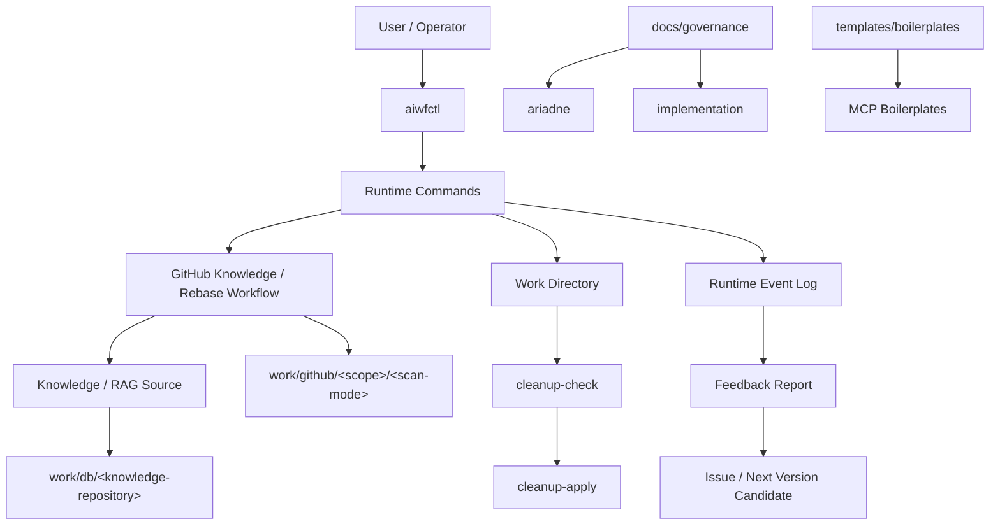

# v0.0.2 Development Notes

v0.0.2 は、v0.0.1 で作った ARIADNE の初期基盤を、実際の本番運用に耐える Runtime / Knowledge / Governance / Boilerplate の基盤へ引き上げるためのバージョンです。

特に、本番 rebase 作業を通じて見えた「復帰できること」「次に何をすべきか分かること」「作業場を安全に片付けられること」「ログから改善点を拾えること」を Runtime の標準機能として扱う方向に整理しました。

このノートは `422e486` 時点のコミット済み内容に加え、作成時点で作業中の MCP boilerplate 改修も含めて記録しています。

## Goal

このバージョンで達成したかったことは、ARIADNE を「一度うまく動いた仕組み」から「本番の長い作業でも復帰・観測・改善できる仕組み」へ進めることです。

v0.0.1 では、GitHub knowledge maintenance と rebase 演習を通じて、AI workflow が Git 履歴・Issue・RAG・プロンプト・テスト仕様を扱うための土台を作りました。v0.0.2 では、その土台を実運用へ持ち込んだときに必要になる周辺能力を整備しています。

主な狙いは次の通りです。

- 本番 rebase / replay 作業で、候補の読み落としや復帰不能を避ける。
- Runtime の状態、次アクション、ブロック理由を確認できるようにする。
- Knowledge / RAG 生成後の work ディレクトリを、安全に cleanup できるようにする。
- Runtime の実行イベントをログとして残し、Feedback report に活用できるようにする。
- ARIADNE 自身のガバナンスと、ARIADNE が作る成果物向けのガバナンスを分けて整理する。
- MCP Server boilerplate を、FastMCP Adapter 分離型の実装サンプルとして育てる。

## Architecture

v0.0.2 時点の構成は、`aiwfctl` を Runtime の主要な入口として、Runtime / Knowledge / Feedback / Governance / Templates が連携する形になりました。



### Runtime Event Log

Runtime の各機能は、共通ログ基盤を通じて `logs/runtime/runtime-events.log` にイベントを出力します。

ログは 1 イベント 1 行で、5MB を目安にローテーションします。形式は次の通りです。

```text
2026-07-21T06:15:32.692+09:00 | 8b8d3b4c1a2d4e6f8091b3c5 | 00002 | {"schema_version":"1.0","level":"warning","component":"ctl","event":"runtime_command_completed","workflow":"self-improvement","phase":"execute","operation_id":"self-improvement:create-feedback","attempt":1,"command":"self-improvement create-feedback","diagnostics":{"recoverable":true,"next_action":"review_command_usage","resume_command":"aiwfctl self-improvement create-feedback"},"input":{},"output":{}}
```

構造は、日時、24桁hexのtrace id、sequence、JSON payload です。JSON payload では `schema_version`、`level`、`workflow`、`phase`、`operation_id`、`attempt`、`diagnostics`、`input`、`output` を分け、実行条件、結果、復帰判断を観測しやすくしました。

### Work Directory

v0.0.2 では、Knowledge / RAG 系の一時作業場と長期保存対象を分けて扱う方針を明確にしました。

```text
work/
  db/
    <ARIADNE_KNOWLEDGE_REPOSITORY>/
      # RAG / Knowledge のバックアップ用ローカルリポジトリ
  github/
    original/
      recent/
        # default branch 由来の GitHub knowledge 作業場
    <target-branch>/
      recent/
        # branch 由来の GitHub knowledge 作業場
```

`work/github/<target-branch-or-original>/<scan-mode>` は、Knowledge 吸収後に cleanup 対象になります。ただし、cleanup は「吸収済みであること」「残すべき成果物ではないこと」を確認してから行う前提です。

### Governance

ガバナンス文書は、ARIADNE 自身に関わるものと、ARIADNE が生成・支援する成果物に関わるものを分けました。

```text
docs/governance/
  ariadne/
    # ARIADNE 本体の運用・設計判断・知識管理に関する規範
  implementation/
    # ARIADNE が作る実装成果物のための規範
    languages/
      # セキュリティ・脆弱性回避を主目的とする言語別規範
```

`implementation/languages` 配下の規範は、単なるコーディングスタイルではなく、成果物を作る際にセキュリティ・脆弱性を避けるための参照規範として位置付けています。

### MCP Boilerplate

MCP boilerplate は、テンプレート名と責務分離を見直しました。

```text
templates/boilerplates/mcp/
  mcp-server-template/
    src/local_model_mcp/
      application/
      domain/
      adapters/
        inbound/fastmcp/
        outbound/
  ai-agent-runtime-template/
```

`mcp-server-template` では、FastMCP を inbound adapter として隔離し、Application / Domain が FastMCP に依存しない構造へ整理しています。

## Major Changes

### 本番 rebase 運用の改善

本番 rebase 作業では、演習で確認した「全件読み込み、rebase すべき位置へ rebase する」という考え方を改めて Runtime 側の前提として扱いました。

この過程で、候補数が想定と違う場合に止まれること、expected SHA を検証できること、文字化けや差分崩れを block として扱えることの重要性が明確になりました。

主な改善点は次の通りです。

- 候補 commit の読み込みと責務判断の明確化。
- expected SHA 周りの検証強化。
- 文字化け検知 marker の定数化と拡張。
- block 判定理由の整理。
- push 許可 package の扱いやすさ改善。
- status / next-action / 復帰コマンドの必要性整理。

### Runtime 復帰・status・cleanup 基盤

長い Runtime 作業では、途中で止まったときに「どこまで進んだか」「次に何をするべきか」「再開してよいか」が分かる必要があります。

v0.0.2 では、復帰コマンド、status / next-action、worktree 再利用、cleanup の考え方を Runtime の標準能力として整理しました。

特に cleanup では、単に一時ディレクトリを削除するのではなく、Knowledge として吸収済みか、長期保存すべき成果物か、派生成果物かを分ける方針にしました。

### Knowledge / RAG cleanup の標準化

GitHub knowledge だけではなく、RAG build 本体、external-web RAG、retrieval 系の派生成果物にも cleanup 判定を広げる方針を取りました。

cleanup の分類は次の考え方です。

- 長期保存する source / backup は cleanup 対象にしない。
- Knowledge 吸収後の一時 work は cleanup 対象にできる。
- retrieval 結果、metrics、index などの派生成果物は、単独では cleanup 保留の根拠にしない。
- metrics だけの空 work は、Knowledge がないため削除扱いにする。
- cleanup 実行前には、人間確認または CTL による確認フローを通す。

これにより、Knowledge 生成系の作業場を「残すもの」と「片付けるもの」に分けやすくなりました。

### Runtime Event Log

Runtime の各機能に、共通ログ基盤を追加しました。

ログは `logs/runtime` に集約し、trace id と sequence によって一連の処理を追跡できるようにしています。これにより、コマンドの入力、出力、終了コード、block 理由、実行時間などを後から確認できます。

`input` と `output` は次のような構造で出力する方針にしました。

```json
{
  "input": {
    "json": false,
    "repo_root": "C:\\github\\v0.0.2\\ariadne-ai-workflow-platform",
    "work_id": ""
  },
  "output": {
    "status": "blocked",
    "exit_code": 2,
    "duration_ms": 29,
    "output_bytes": 562,
    "reason": "required_argument_missing"
  }
}
```

この形式により、ログが単なる実行履歴ではなく、後続の Feedback report や改善 Issue の材料になります。

### Feedback report の強化

Runtime Event Log を Feedback report に取り込めるようにしました。

担当エージェントは、Runtime の失敗、block、duration、出力サイズ、trace id を材料にして、実行時に何が起きたかを report に残せます。これにより、Feedback report は単なる感想欄ではなく、Runtime 観測に基づく改善提案の入口になりました。

この位置付けは、v0.0.2 で「スマートご意見箱」として整理した重要な変更です。

### Governance document の整理

`docs/governance` 配下を、ARIADNE 自体の規範と、ARIADNE が作る成果物の規範に分けました。

`docs/governance/implementation` では、ラフな ASCII 図や文章を Mermaid 図と本文に清書し、意図が伝わる文書へ整理しました。

特に `languages` 配下の規範については、成果物実装時に参照するセキュリティ・脆弱性回避のための規範であることを明記しました。

### MCP boilerplate の FastMCP Adapter 分離

`templates/boilerplates/mcp/mcp-server-template` を、FastMCP Adapter 分離型の MCP Server boilerplate として改修しました。

主な変更は次の通りです。

- FastMCP 依存を `adapters/inbound/fastmcp` に隔離。
- Application / Domain / Port / Adapter の責務を分離。
- inbound request / response mapper と error mapper を追加。
- outbound adapter と use case を分離。
- Dockerfile、compose、実行 script、検証 script を追加。
- FastMCP を optional dependency として扱う。
- Application 層が FastMCP に依存していないことをテストで確認。

また、テンプレート名をより汎用的な名前へ変更しました。

- `local-model-mcp-server-template` から `mcp-server-template` へ変更。
- `local-ai-agent-runtime-template` から `ai-agent-runtime-template` へ変更。

### Boilerplate UT の pytest cache 経路整理

boilerplate の UT 実行で、リポジトリルートに `.pytest_cache` が作られる流れが見つかりました。

これを避けるため、`mcp-server-template` の test script では template root に移動してから pytest を実行し、cache も `templates/boilerplates/mcp/mcp-server-template/.pytest_cache` に作られるようにしました。

あわせて、リポジトリルートの `.gitignore` に `.pytest_cache/` を追加し、template 側でも `.pytest_cache/`、`uv.lock`、`*.egg-info/` を無視する方針にしています。

## Design Decisions

### Runtime の入口は aiwfctl に寄せる

Runtime 機能は、個別 script の直実行ではなく `aiwfctl` から扱えるように寄せる方針にしました。

理由は、復帰、status、next-action、cleanup、logging、feedback などの横断機能を、同じ入口で観測・制御したいからです。

### 観測と解釈を分ける

Runtime Event Log は、実行時に起きた事実を残す場所です。一方、Feedback report は、その事実を読み取って改善提案へ変換する場所です。

この分離により、ログは機械処理しやすく、report は人間が判断しやすい形になります。

### Feedback は自動修正ではなく改善候補にする

Feedback report は、すぐに実装へ流すのではなく、Human Review を経て Issue / Next Version 候補へ変換する前提にしました。

Runtime が自動で改善点を見つけても、採用判断は人間が行うことで、ARIADNE の intent と decision を保ちます。

### cleanup は「消せるか」ではなく「残す根拠があるか」で判断する

一時作業場は、ファイルが存在するかどうかではなく、長期保存すべき Knowledge / artifact として扱う根拠があるかで判断します。

metrics だけの空 work は、Knowledge がないため cleanup 対象です。一方で、RAG source backup や approved artifact は cleanup 対象にしません。

### FastMCP は Core ではなく Adapter として扱う

MCP Server boilerplate では、FastMCP を便利な実装基盤として使いつつ、Application / Domain には依存させない方針にしました。

これにより、将来的に別の inbound adapter を追加しても、use case や domain rule を維持できます。

### テンプレート名は初期用途に寄せすぎない

`local-model-mcp-server-template` や `local-ai-agent-runtime-template` は、初期サンプルとしては分かりやすい一方、ARIADNE の汎用 boilerplate としては用途を狭く見せます。

そのため、`mcp-server-template` と `ai-agent-runtime-template` に変更しました。

### pytest cache は実行対象の template に閉じる

boilerplate の UT は、リポジトリ全体ではなく boilerplate 自身の品質確認です。

そのため、pytest rootdir と cache dir は template 配下に寄せ、ルートにテスト副産物を漏らさない方針にしました。

## Lessons Learned

本番 rebase が比較的スムーズに進んだ理由は、事前に runtime、チェックシート、演習、検証観点を準備していたことが大きいです。

一方で、本番だからこそ見えた改善点もありました。

- 候補数が想定と違うときに、即座に理由を追える仕組みが必要。
- 復帰コマンド、status、next-action は長い作業では必須に近い。
- expected SHA 検証は、履歴操作の安全性を支える重要な gate になる。
- 文字化けは軽微な表示問題ではなく、誤判断につながる block 条件として扱うべき。
- Runtime log は、あとから Feedback report を充実させる材料になる。
- cleanup は、RAG / Knowledge の保存方針と一緒に設計しないと曖昧になる。
- language governance は、style ではなく security / vulnerability avoidance の規範として明示した方がよい。
- boilerplate UT は、実行場所によって root cache を作るため、script 側で実行 root を固定する必要がある。
- template 名は、最初の用途よりも将来の再利用性を優先した方がよい。

## Verification

v0.0.2 の主要変更では、Runtime と template の検証を行いました。

- Runtime 全体テスト: `726 passed`
- Runtime spec-check: `pytest_count/spec_count = 726/726`
- MCP boilerplate 関連 Runtime テスト: `15 passed`
- `mcp-server-template` UT: `8 passed`
- `ai-agent-runtime-template` UT: `5 passed`
- `python -m local_model_mcp --health`: `status = ok`
- `python -m local_model_mcp.server --health`: `status = ok`

## Next Version

次のバージョンでは、v0.0.2 で見えた運用改善をさらに Runtime の標準機能へ落とし込む予定です。

候補は次の通りです。

- 復帰コマンド、status、next-action の UX 改善。
- Runtime trace の選択、最新 trace 参照、Feedback report 生成の導線改善。
- expected SHA、文字化け、block 条件の検証を他 workflow にも展開。
- RAG build、external-web RAG、retrieval 系派生成果物の cleanup 分類をさらに明文化。
- cleanup-check / cleanup-apply を Knowledge workflow 以外にも使いやすくする。
- Feedback report から Issue 候補へつなぐ review flow の整備。
- MCP boilerplate の FastMCP 実依存込み integration test。
- Docker / compose を含む boilerplate 検証 evidence の追加。
- development-notes と Issue / commit / Feedback report の相互参照を強化。

v0.0.2 は、ARIADNE が「作業を実行する」だけでなく、「作業から学び、次の改善へつなぐ」ための基盤を整えたバージョンです。
