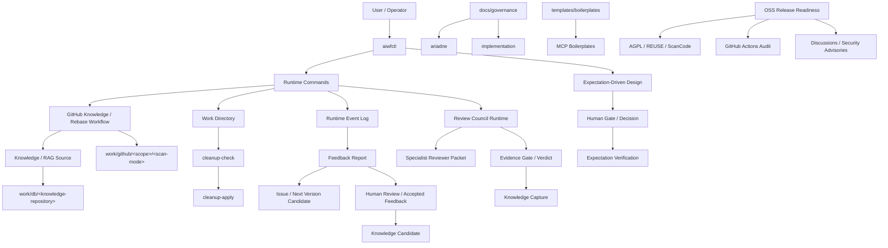

# v0.0.2 Development Notes

v0.0.2 は、v0.0.1 で作った ARIADNE の初期基盤を、実際の本番運用に耐える Runtime / Knowledge / Governance / Boilerplate の基盤へ引き上げるためのバージョンです。

特に、本番 rebase 作業を通じて見えた「復帰できること」「次に何をすべきか分かること」「作業場を安全に片付けられること」「ログから改善点を拾えること」を Runtime の標準機能として扱う方向に整理しました。

このノートは `e43606b` 時点のコミット済み内容に加え、作成時点で作業中の OSS 公開準備、GitHub Actions 監査 workflow、連絡導線整備も含めて記録しています。

## Goal

このバージョンで達成したかったことは、ARIADNE を「一度うまく動いた仕組み」から「本番の長い作業でも復帰・観測・改善できる仕組み」へ進めることです。

v0.0.1 では、GitHub knowledge maintenance と rebase 演習を通じて、AI workflow が Git 履歴・Issue・RAG・プロンプト・テスト仕様を扱うための土台を作りました。v0.0.2 では、その土台を実運用へ持ち込んだときに必要になる周辺能力を整備しています。

主な狙いは次の通りです。

- 本番 rebase / replay 作業で、候補の読み落としや復帰不能を避ける。
- Runtime の状態、次アクション、ブロック理由を確認できるようにする。
- Knowledge / RAG 生成後の work ディレクトリを、安全に cleanup できるようにする。
- Runtime の実行イベントをログとして残し、Feedback report に活用できるようにする。
- Specialist Review を Review Council Runtime として扱い、Finding、Issue、Evidence Gate、Verdict、Knowledge Capture へ接続できるようにする。
- ARIADNE 自身のガバナンスと、ARIADNE が作る成果物向けのガバナンスを分けて整理する。
- MCP Server boilerplate を、FastMCP Adapter 分離型の実装サンプルとして育てる。
- Expectation-Driven Design Flow を、設計候補、期待評価、Human Gate、検証、feedback へつながる flow として実装する。
- OSS 公開に向けて、AGPL-3.0-or-later 方針、第三者 license 監査、REUSE metadata、GitHub 上の連絡導線を整備する。

## Architecture

v0.0.2 時点の構成は、`aiwfctl` を Runtime の主要な入口として、Runtime / Knowledge / Feedback / Governance / Templates が連携する形になりました。



### Runtime Event Log

Runtime の各機能は、共通ログ基盤を通じて `logs/runtime/runtime-events.log` にイベントを出力します。

ログは 1 イベント 1 行で、5MB を目安にローテーションします。形式は次の通りです。

```text
2026-07-21T06:15:32.692+09:00 | 8b8d3b4c1a2d4e6f8091b3c5 | 00002 | {"schema_version":"1.0","level":"warning","component":"ctl","event":"runtime_command_completed","workflow":"self-improvement","phase":"execute","operation_id":"self-improvement:create-feedback","attempt":1,"command":"self-improvement create-feedback","diagnostics":{"recoverable":true,"next_action":"review_command_usage","resume_command":"aiwfctl self-improvement create-feedback"},"input":{},"output":{}}
```

構造は、日時、24桁hexのtrace id、sequence、JSON payload です。JSON payload では `schema_version`、`level`、`workflow`、`phase`、`operation_id`、`attempt`、`diagnostics`、`input`、`output` を分け、実行条件、結果、復帰判断を観測しやすくしました。

Runtime Event Log は、すべてを人間が読むための長文 report ではなく、後続 Runtime、Feedback report、Review Council、Knowledge 化が扱える時系列の観測 source として位置付けています。

そのため、secret、token、password、credential などの機密情報は mask し、必要な判断材料だけを evidence や process report へ昇格させます。

### Work Directory

v0.0.2 では、Knowledge / RAG 系の一時作業場と長期保存対象を分けて扱う方針を明確にしました。

```text
work/
  db/
    <ARIADNE_KNOWLEDGE_REPOSITORY>/
      # RAG / Knowledge のバックアップ用ローカルリポジトリ
  github/
    original/
      recent/
        # default branch 由来の GitHub knowledge 作業場
    <target-branch>/
      recent/
        # branch 由来の GitHub knowledge 作業場
```

`work/github/<target-branch-or-original>/<scan-mode>` は、Knowledge 吸収後に cleanup 対象になります。ただし、cleanup は「吸収済みであること」「残すべき成果物ではないこと」を確認してから行う前提です。

### Governance

ガバナンス文書は、ARIADNE 自身に関わるものと、ARIADNE が生成・支援する成果物に関わるものを分けました。

```text
docs/governance/
  ariadne/
    # ARIADNE 本体の運用・設計判断・知識管理に関する規範
  implementation/
    # ARIADNE が作る実装成果物のための規範
    languages/
      # セキュリティ・脆弱性回避を主目的とする言語別規範
```

`implementation/languages` 配下の規範は、単なるコーディングスタイルではなく、成果物を作る際にセキュリティ・脆弱性を避けるための参照規範として位置付けています。

### MCP Boilerplate

MCP boilerplate は、テンプレート名と責務分離を見直しました。

```text
templates/boilerplates/mcp/
  mcp-server-template/
    src/local_model_mcp/
      application/
      domain/
      adapters/
        inbound/fastmcp/
        outbound/
  ai-agent-runtime-template/
```

`mcp-server-template` では、FastMCP を inbound adapter として隔離し、Application / Domain が FastMCP に依存しない構造へ整理しています。

## Major Changes

### 本番 rebase 運用の改善

本番 rebase 作業では、演習で確認した「全件読み込み、rebase すべき位置へ rebase する」という考え方を改めて Runtime 側の前提として扱いました。

この過程で、候補数が想定と違う場合に止まれること、expected SHA を検証できること、文字化けや差分崩れを block として扱えることの重要性が明確になりました。

主な改善点は次の通りです。

- 候補 commit の読み込みと責務判断の明確化。
- expected SHA 周りの検証強化。
- 文字化け検知 marker の定数化と拡張。
- block 判定理由の整理。
- push 許可 package の扱いやすさ改善。
- status / next-action / 復帰コマンドの必要性整理。

### Runtime 復帰・status・cleanup 基盤

長い Runtime 作業では、途中で止まったときに「どこまで進んだか」「次に何をするべきか」「再開してよいか」が分かる必要があります。

v0.0.2 では、復帰コマンド、status / next-action、worktree 再利用、cleanup の考え方を Runtime の標準能力として整理しました。

特に cleanup では、単に一時ディレクトリを削除するのではなく、Knowledge として吸収済みか、長期保存すべき成果物か、派生成果物かを分ける方針にしました。

### Knowledge / RAG cleanup の標準化

GitHub knowledge だけではなく、RAG build 本体、external-web RAG、retrieval 系の派生成果物にも cleanup 判定を広げる方針を取りました。

cleanup の分類は次の考え方です。

- 長期保存する source / backup は cleanup 対象にしない。
- Knowledge 吸収後の一時 work は cleanup 対象にできる。
- retrieval 結果、metrics、index などの派生成果物は、単独では cleanup 保留の根拠にしない。
- metrics だけの空 work は、Knowledge がないため削除扱いにする。
- cleanup 実行前には、人間確認または CTL による確認フローを通す。

これにより、Knowledge 生成系の作業場を「残すもの」と「片付けるもの」に分けやすくなりました。

### Runtime Event Log

Runtime の各機能に、共通ログ基盤を追加しました。

ログは `logs/runtime` に集約し、trace id と sequence によって一連の処理を追跡できるようにしています。これにより、コマンドの入力、出力、終了コード、block 理由、実行時間などを後から確認できます。

`input` と `output` は次のような構造で出力する方針にしました。

```json
{
  "input": {
    "json": false,
    "repo_root": "C:\\github\\v0.0.2\\ariadne-ai-workflow-platform",
    "work_id": ""
  },
  "output": {
    "status": "blocked",
    "exit_code": 2,
    "duration_ms": 29,
    "output_bytes": 562,
    "reason": "required_argument_missing"
  }
}
```

この形式により、ログが単なる実行履歴ではなく、後続の Feedback report や改善 Issue の材料になります。

CTL 経由の runtime command では、開始、完了、失敗、block を共通イベントとして扱い、`diagnostics.recoverable`、`diagnostics.next_action`、`diagnostics.resume_command` を残します。

これにより、失敗を単なる例外として捨てず、再開可能性、次の確認手順、改善候補へ変換できるようにしました。

### Feedback report の強化

Runtime Event Log を Feedback report に取り込めるようにしました。

担当エージェントは、Runtime の失敗、block、duration、出力サイズ、trace id を材料にして、実行時に何が起きたかを report に残せます。これにより、Feedback report は単なる感想欄ではなく、Runtime 観測に基づく改善提案の入口になりました。

この位置付けは、v0.0.2 で「スマートご意見箱」として整理した重要な変更です。

`aiwfctl self-improvement create-feedback` は、対象 workflow、観測された摩擦、期待する改善、evidence、runtime trace id を受け取り、`work/feedback/` に Feedback report を保存します。

runtime trace id が指定された場合は、`logs/runtime/runtime-events.log` から該当 trace を抽出し、次を report に含めます。

- trace id。
- event count。
- command。
- status。
- reason。
- duration。
- blocked / failed event の要約。

Feedback report は自動で採用されません。`self-improvement review-feedback` で Human Review の decision、reviewer、reason を追記し、Accepted になったものだけを Issue body 候補や後続改善候補に進めます。

また、Feedback report は RAG / Knowledge 候補にもできます。これは、ARIADNE 自身の作業摩擦や docs gap を、次回以降の workflow 改善に再利用できる形で残すためです。

### Review Council Runtime の実装

v0.0.2 では、Specialist Review の結果を「読める Markdown report」で終わらせず、Runtime が判定できる Review Packet、Finding、Review Issue、Evidence Gate、Challenge、Verdict として扱う Review Council Runtime を実装しました。

目的は、レビュー工程を次工程へ渡せる検査済みの artifact にすることです。

主な実装対象は次の通りです。

- `aiwfctl review plan` による必要 reviewer と選定理由の記録。
- `aiwfctl review start` による Review Council session 作成。
- `aiwfctl review handoff` による reviewer 別 handoff packet 生成。
- `aiwfctl review orchestrate` / `review next-action` による次アクション提示。
- `aiwfctl review run-specialist` による Specialist Reviewer Agent 向け実行 packet 作成。
- `aiwfctl review execute-specialist` による承認済みローカル Agent command 実行。
- `review draft-findings` による specialist report からの Finding 候補抽出。
- `review add-finding`、`review issues`、`review reinspect` による指摘の構造化と再検査。
- `review challenge` による counterexample / 反証確認。
- `review evidence-gate` による evidence path、required test、Review Council artifact の検査。
- `review verdict` による `APPROVED` / `APPROVED_WITH_RISK` / `CHANGES_REQUIRED` / `HUMAN_DECISION_REQUIRED` / `REJECTED` 判定。
- `review capture-knowledge` / `review rag-build` による Review Council artifact の Knowledge / RAG 候補化。

LangGraph が利用できる環境では Review Council 用の state graph を使い、利用できない場合も `runtime-runbook` として同じ contract で進めるようにしました。重要なのは、Agent 実行そのものを自動化することではなく、専門 review の入力、出力、未完了条件、Human Gate、Evidence を Runtime が追跡できる形に固定することです。

### Governance document の整理

`docs/governance` 配下を、ARIADNE 自体の規範と、ARIADNE が作る成果物の規範に分けました。

`docs/governance/implementation` では、ラフな ASCII 図や文章を Mermaid 図と本文に清書し、意図が伝わる文書へ整理しました。

特に `languages` 配下の規範については、成果物実装時に参照するセキュリティ・脆弱性回避のための規範であることを明記しました。

### MCP boilerplate の FastMCP Adapter 分離

`templates/boilerplates/mcp/mcp-server-template` を、FastMCP Adapter 分離型の MCP Server boilerplate として改修しました。

主な変更は次の通りです。

- FastMCP 依存を `adapters/inbound/fastmcp` に隔離。
- Application / Domain / Port / Adapter の責務を分離。
- inbound request / response mapper と error mapper を追加。
- outbound adapter と use case を分離。
- Dockerfile、compose、実行 script、検証 script を追加。
- FastMCP を optional dependency として扱う。
- Application 層が FastMCP に依存していないことをテストで確認。

また、テンプレート名をより汎用的な名前へ変更しました。

- `local-model-mcp-server-template` から `mcp-server-template` へ変更。
- `local-ai-agent-runtime-template` から `ai-agent-runtime-template` へ変更。

### Boilerplate UT の pytest cache 経路整理

boilerplate の UT 実行で、リポジトリルートに `.pytest_cache` が作られる流れが見つかりました。

これを避けるため、`mcp-server-template` の test script では template root に移動してから pytest を実行し、cache も `templates/boilerplates/mcp/mcp-server-template/.pytest_cache` に作られるようにしました。

あわせて、リポジトリルートの `.gitignore` に `.pytest_cache/` を追加し、template 側でも `.pytest_cache/`、`uv.lock`、`*.egg-info/` を無視する方針にしています。

### Expectation-Driven Design Flow の実装

v0.0.2 では、Expectation-Driven Design Flow を Runtime の設計支援機能として実装しました。

従来の「候補を作って比較する」だけの設計補助ではなく、利用文脈、期待、候補、実現可能性、比較、Human Decision、選択案の refinement、interaction contract、実装後検証、feedback をつなぐ流れとして整理しています。

主な実装対象は次の通りです。

- usage context / expectation extraction の schema と scaffold。
- expectation review report と Human Gate 対象化。
- design candidate の構造 model、schema、scaffold 生成。
- candidate feasibility report の JSON / Markdown 出力。
- multi-axis evaluation と比較 report への多軸表統合。
- trade-off analysis の JSON / Markdown 出力と比較 report 統合。
- selected design refinement と、複数案統合時の再評価。
- interaction contracts の Given / When / Then / Must Not 形式生成。
- expectation verification と expectation feedback の artifact 化。
- Dispatcher / Review Council 連携のための context 受け渡し。

また、初期実装では YAML ではなく JSON を主フォーマットとして採用しました。理由は、Runtime 側の schema validation、test、machine-readable artifact、後続の自動処理との相性を優先したためです。

### `.ariadne` への AI workflow 資産移動

GitHub 向け設定と AI workflow 向け資産が `.github` 配下に混在していたため、agent、prompt、schema、shared context を `.ariadne/` へ移動しました。

これにより、`.github` は GitHub platform の設定、`.ariadne` は ARIADNE / AI workflow の設定という責務境界が明確になりました。

あわせて、Runtime 定数、Review Council の prompt path、workflow doctor の検査対象、skills の参照、docs、tests の期待値を `.ariadne/...` に更新しています。

### Runtime magic number の定数化

Runtime 内に散在していた値関連の magic number を、目的別の constants module へ整理しました。

主な整理先は次の通りです。

- `runtime/constants/runtime_values.py`
- `runtime/constants/cli_defaults.py`
- `runtime/constants/workflow_limits.py`
- `runtime/workflow/dispatcher_constants.py`
- `runtime/ctl/help_constants.py`
- `runtime/design/expectation/constants.py`
- `runtime/rag/scoring_constants.py`
- `runtime/review/constants.py`

対象は schema / registry version、score 正規化、confidence / weight、file hash chunk、runtime event log、GitHub API timeout、RAG scoring、close archive、GitHub knowledge maintenance、UI / CLI default、workflow limit などです。

残した数値は、`return 0/1/2`、`parents[2]`、`json.dumps(indent=2)`、`split(..., 1)`、test expectation、domain example のように、慣用的または文脈上その場に残した方が読みやすいものに限定しました。

### OSS 公開基盤と AGPL 方針の整備

ARIADNE を OSS として公開するため、license、contribution、security、citation、notice、trademark、release、third-party dependency review の文書を整備しました。

repository license は `AGPL-3.0-or-later` とし、`LICENSE`、`LICENSES/AGPL-3.0-or-later.txt`、`REUSE.toml`、package metadata、README、legal docs の整合を確認しています。

主な方針は次の通りです。

- ARIADNE 本体は `AGPL-3.0-or-later`。
- ARIADNE を tool として使っただけでは、生成 artifact に ARIADNE の AGPL license を自動適用しない。
- ARIADNE の source code や保護対象 material を生成 artifact に含める場合は、別途 license obligation が生じる可能性を明記する。
- trademark は `docs/brand` 配下に日本語 / 英語で整理する。
- legal docs は方針文書と evidence を分け、`docs/legal/evidence` に監査結果や release gate の状態を残す。

### License / dependency audit workflow

OSS 公開前の監査として、GitHub Actions に license / dependency audit workflow を追加しました。

```text
.github/workflows/
  scancode.yml
  reuse-lint.yml
  dependency-review.yml

.github/config/
  dependency-review.yml
```

`ScanCode` は repository 全体の license / copyright / package 検出、`REUSE lint` は SPDX metadata の機械可読性、`Dependency Review` は pull request で追加・変更される dependency license と vulnerability を確認します。

Dependency Review の設定は当初 `.github/workflows/config` 配下に置く案も検討しましたが、`act` が非 workflow YAML を workflow として誤検出するため、`.github/config/dependency-review.yml` に配置しました。

ローカル本番相当の予行では、`REUSE lint` と `ScanCode` は artifact upload まで成功しました。Dependency Review は private repository / GitHub API / Dependency graph / GitHub Advanced Security 条件に依存するため、ローカルでは本体検査を完了できませんでした。公開後または GitHub 側条件を満たした状態で、GitHub Actions 本番実行による最終確認が必要です。

### OSS 連絡導線の整理

公開後の連絡窓口は、通常の利用者連絡と security-sensitive な連絡を分けました。

- バグ報告、質問、提案、使い方の相談は GitHub Discussions。
- セキュリティ・脆弱性の連絡は GitHub Security Advisories。
- 脆弱性詳細、exploit 手順、secret、credential、private repository information は public issue、Discussions、pull request、公開コメントへ投稿しない。

この方針を `README.md`、`CONTRIBUTING.md` / `CONTRIBUTING.en.md`、`SECURITY.md` / `SECURITY.en.md`、`.github/ISSUE_TEMPLATE/config.yml`、legal evidence に反映しました。

## Design Decisions

### Runtime の入口は aiwfctl に寄せる

Runtime 機能は、個別 script の直実行ではなく `aiwfctl` から扱えるように寄せる方針にしました。

理由は、復帰、status、next-action、cleanup、logging、feedback などの横断機能を、同じ入口で観測・制御したいからです。

### 観測と解釈を分ける

Runtime Event Log は、実行時に起きた事実を残す場所です。一方、Feedback report は、その事実を読み取って改善提案へ変換する場所です。

この分離により、ログは機械処理しやすく、report は人間が判断しやすい形になります。

### Feedback は自動修正ではなく改善候補にする

Feedback report は、すぐに実装へ流すのではなく、Human Review を経て Issue / Next Version 候補へ変換する前提にしました。

Runtime が自動で改善点を見つけても、採用判断は人間が行うことで、ARIADNE の intent と decision を保ちます。

これは、Runtime が観測した「不便」「詰まり」「help drift」「docs gap」を、即時変更ではなく、証跡付きの改善候補として扱うためです。

通常 workflow の途中で `/self-improvement` を勝手に実行せず、Feedback report を残してから、人間がまとめて採用・不採用・保留を判断する方針にしました。

### cleanup は「消せるか」ではなく「残す根拠があるか」で判断する

一時作業場は、ファイルが存在するかどうかではなく、長期保存すべき Knowledge / artifact として扱う根拠があるかで判断します。

metrics だけの空 work は、Knowledge がないため cleanup 対象です。一方で、RAG source backup や approved artifact は cleanup 対象にしません。

### FastMCP は Core ではなく Adapter として扱う

MCP Server boilerplate では、FastMCP を便利な実装基盤として使いつつ、Application / Domain には依存させない方針にしました。

これにより、将来的に別の inbound adapter を追加しても、use case や domain rule を維持できます。

### テンプレート名は初期用途に寄せすぎない

`local-model-mcp-server-template` や `local-ai-agent-runtime-template` は、初期サンプルとしては分かりやすい一方、ARIADNE の汎用 boilerplate としては用途を狭く見せます。

そのため、`mcp-server-template` と `ai-agent-runtime-template` に変更しました。

### pytest cache は実行対象の template に閉じる

boilerplate の UT は、リポジトリ全体ではなく boilerplate 自身の品質確認です。

そのため、pytest rootdir と cache dir は template 配下に寄せ、ルートにテスト副産物を漏らさない方針にしました。

### 設計 artifact は JSON を主フォーマットにする

Expectation-Driven Design Flow では、初期の scaffold や report を JSON 中心にしました。

設計工程では人間が読む Markdown も必要ですが、Runtime が比較、検証、feedback、Review Council 連携に使う一次 artifact は machine-readable である必要があります。そのため、JSON を主 artifact、Markdown を review 補助として扱う方針にしました。

### GitHub と AI workflow の設定境界を分ける

`.github` は GitHub platform が読む設定に限定し、ARIADNE / AI workflow 固有の agent、prompt、schema、shared context は `.ariadne` に寄せる方針にしました。

これにより、GitHub Actions、Issue / PR template、release notes 設定と、AI workflow runtime の資産が混ざらなくなりました。

### OSS 監査結果は artifact と evidence に分ける

ScanCode や Dependency Review の生 artifact は GitHub Actions artifact として保存し、repository には方針文書と review evidence を残す方針にしました。

これは、巨大な監査結果を repository に直接 commit せず、release 判断に必要な要約、未解決項目、human review 結果だけを追跡するためです。

### Review Council は自動承認ではなく判定材料の構造化に使う

Review Council Runtime は、Specialist Agent の意見をそのまま最終判断にする仕組みではありません。

reviewer selection、handoff、finding draft、challenge、evidence gate、verdict policy を通じて、Human Gate の前に「何が確認済みで、何が未確認で、どのriskを受け入れるのか」を明確にするための Runtime contract として扱います。

このため、`execute-specialist` は `--human-check approved` を要求し、Finding draft は正式 Finding として自動登録せず、確認後に `add-finding` で登録する方針にしました。

## Lessons Learned

本番 rebase が比較的スムーズに進んだ理由は、事前に runtime、チェックシート、演習、検証観点を準備していたことが大きいです。

一方で、本番だからこそ見えた改善点もありました。

- 候補数が想定と違うときに、即座に理由を追える仕組みが必要。
- 復帰コマンド、status、next-action は長い作業では必須に近い。
- expected SHA 検証は、履歴操作の安全性を支える重要な gate になる。
- 文字化けは軽微な表示問題ではなく、誤判断につながる block 条件として扱うべき。
- Runtime log は、あとから Feedback report を充実させる材料になる。
- Runtime log は完全な説明文ではなく、後続処理が読める観測 source として設計した方が扱いやすい。
- Feedback はその場の自動修正ではなく、Human Review 済みの改善候補として残すと、intent と decision を保ちやすい。
- trace id、next action、resume command が揃うと、停止や失敗を改善の入口に変換しやすい。
- Specialist Review は自由記述 report のままだと次工程へ渡しにくく、Finding / Evidence / Verdict の contract に正規化する必要がある。
- 専門 reviewer を自動実行できるようにしても、実行許可、指摘採否、risk acceptance は Human Gate として分ける必要がある。
- cleanup は、RAG / Knowledge の保存方針と一緒に設計しないと曖昧になる。
- language governance は、style ではなく security / vulnerability avoidance の規範として明示した方がよい。
- boilerplate UT は、実行場所によって root cache を作るため、script 側で実行 root を固定する必要がある。
- template 名は、最初の用途よりも将来の再利用性を優先した方がよい。
- 設計工程も Runtime artifact として扱うなら、期待、候補、比較、判断、検証を分けて保存する必要がある。
- YAML は人間には読みやすいが、Runtime の schema validation と差分検証では JSON の方が扱いやすい場面がある。
- `.github/workflows` 配下には workflow 以外の YAML を置くと、`act` などの検証 tool が誤検出する。
- Dependency Review は public repository では使いやすいが、private repository では GitHub Advanced Security や Dependency graph 条件に左右される。
- OSS 公開では、license 本文だけでなく、REUSE metadata、third-party dependency review、security contact、Discussions 導線までまとめて整える必要がある。
- Magic number の定数化は、すべての数値を消すことではなく、意味を持つ値と慣用表現を分けることが重要。

## Verification

v0.0.2 の主要変更では、Runtime と template の検証を行いました。

- Runtime 全体テスト: `726 passed`
- Runtime spec-check: `pytest_count/spec_count = 726/726`
- MCP boilerplate 関連 Runtime テスト: `15 passed`
- Review Council Runtime テスト: `28 passed`
- Runtime Event Log / Self-Improvement Feedback 関連テスト: `88 passed`
- `mcp-server-template` UT: `8 passed`
- `ai-agent-runtime-template` UT: `5 passed`
- `python -m local_model_mcp --health`: `status = ok`
- `python -m local_model_mcp.server --health`: `status = ok`
- Expectation-Driven Design Flow 関連テスト: `7 passed`
- OSS release foundation テスト: `12 passed`
- Runtime magic number 整理後の関連テスト: 対象領域ごとに `compileall` と pytest subset を実行。
- `python -m compileall -q runtime`: pass
- `yamllint`: GitHub workflow / config / issue template で pass
- `actionlint`: `.github/workflows/*.yml` で pass
- `act --list`: `.github/workflows` の workflow 検出 pass
- `REUSE lint` GitHub Actions ローカル予行: pass、artifact upload 成功
- `ScanCode` GitHub Actions ローカル予行: pass、`2146` resources scan、artifact upload 成功
- `aiwfctl release validate --json`: `status = pass`, `errors = 0`

## Next Version

次のバージョンでは、v0.0.2 で見えた運用改善をさらに Runtime の標準機能へ落とし込む予定です。

候補は次の通りです。

- 復帰コマンド、status、next-action の UX 改善。
- Runtime trace の選択、最新 trace 参照、Feedback report 生成の導線改善。
- expected SHA、文字化け、block 条件の検証を他 workflow にも展開。
- RAG build、external-web RAG、retrieval 系派生成果物の cleanup 分類をさらに明文化。
- cleanup-check / cleanup-apply を Knowledge workflow 以外にも使いやすくする。
- Feedback report から Issue 候補へつなぐ review flow の整備。
- MCP boilerplate の FastMCP 実依存込み integration test。
- Docker / compose を含む boilerplate 検証 evidence の追加。
- development-notes と Issue / commit / Feedback report の相互参照を強化。
- GitHub Actions 本番で ScanCode / REUSE lint / Dependency Review を実行し、artifact を公開前 evidence として確認する。
- Dependency Review を public repository 化後に再確認する。
- `aiwfctl release validate` の warning を release gate で継続 review する。
- Discussions と GitHub Security Advisories の表示・導線を公開後に確認する。

v0.0.2 は、ARIADNE が「作業を実行する」だけでなく、「作業から学び、次の改善へつなぐ」ための基盤を整えたバージョンです。
