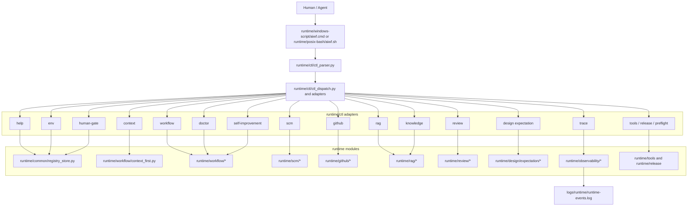
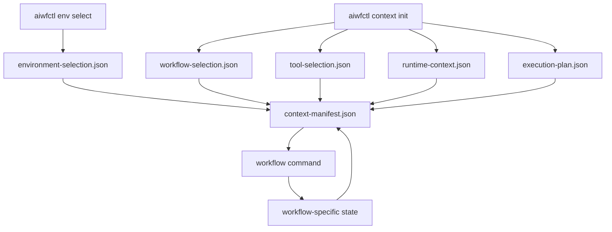
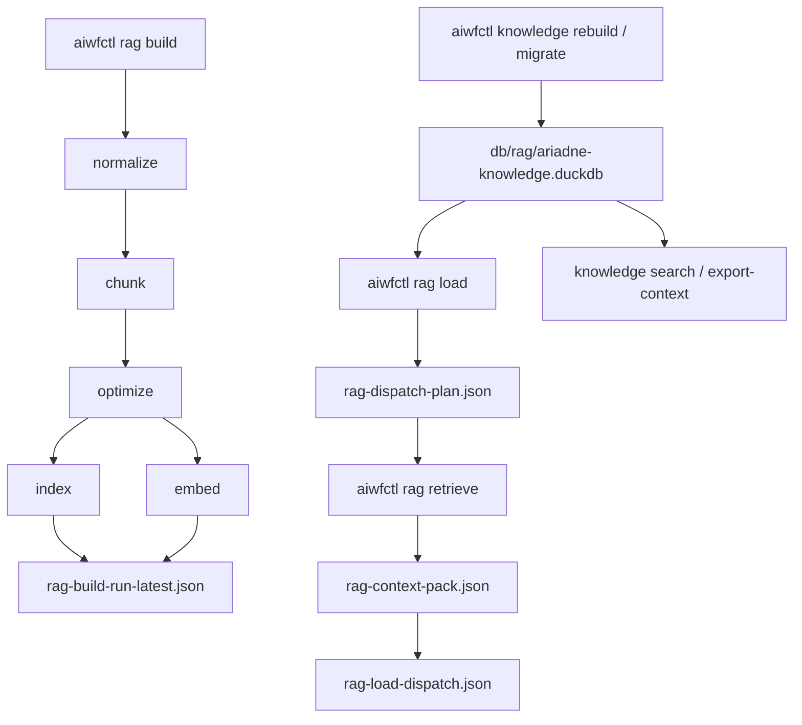
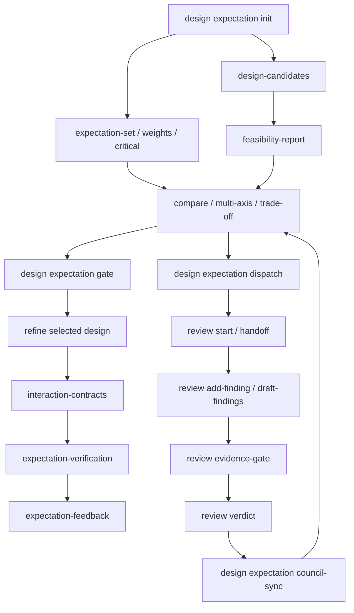
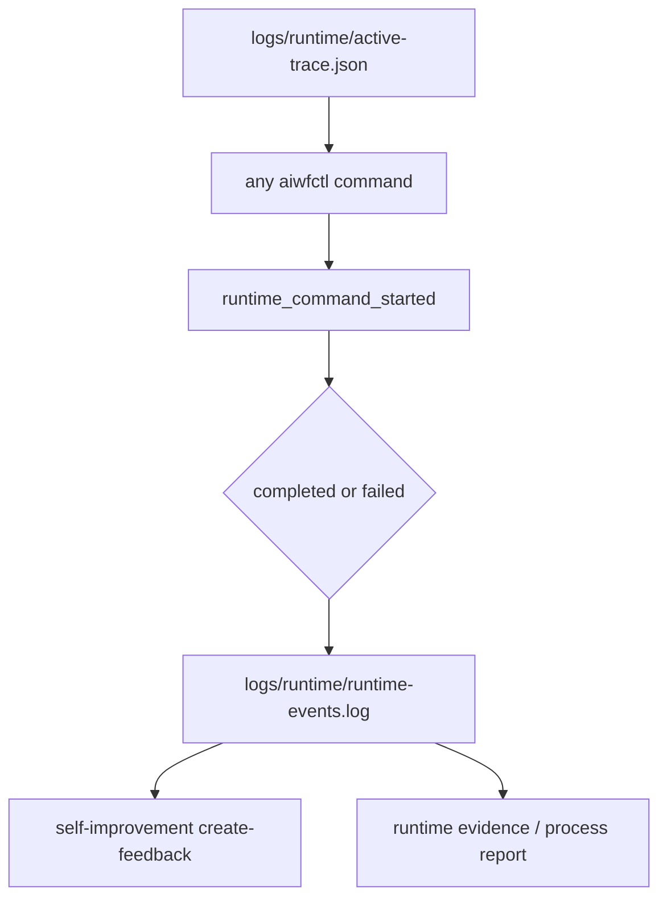

# aiwfctl Runtime Command Map

この文書は、`aiwfctl` の主要commandがどのruntime moduleを呼び、どのartifactを読む・書くのかを図で示します。

詳細なコマンド仕様は `aiwfctl help`、`docs/reference/runtime.md`、各 `docs/workflows/`、`runtime/ctl/ctl_parser.py` を優先します。

## 全体像

## Command群と主な入出力

| Command | 主なruntime module | 主に読むもの | 主に書くもの |
| --- | --- | --- | --- |
| `aiwfctl help` | `runtime/ctl/ctl_help.py`, `runtime/common/registry_store.py` | `db/registries/registry.duckdb`, `templates/registries/*.json` | `work/help/ai-workflow-help.md` |
| `aiwfctl env` | `runtime/ctl/ctl.py`, registry store | environment profiles registry | `work/<work-id>/context/environment-selection.json`, `context-manifest.json` |
| `aiwfctl context` | `runtime/workflow/context_first.py`, dispatcher context | Dispatcher input, existing context | `workflow-selection.json`, `tool-selection.json`, `runtime-context.json`, `execution-plan.json`, `context-manifest.json` |
| `aiwfctl human-gate` | `runtime/ctl/ctl_human_gate_adapter.py`, registry store | human gate registry | Human Gate check result |
| `aiwfctl trace` | `runtime/observability/logger.py` | `logs/runtime/active-trace.json` | `active-trace.json`, `runtime-events.log` |
| `aiwfctl intake` | `runtime/intake/intake_requirements.py` | `work/requirements/` | `work/<receipt-id>/context/*`, initial artifact index |
| `aiwfctl workflow` | `runtime/workflow/*` | work context, workflow-specific inputs | process report, workflow state, docs-sync / knowledge-capture artifacts |
| `aiwfctl scm` | `runtime/scm/*` | requirements, repository state, Git settings | `scm-state.json`, comparison report, branch / commit / push record |
| `aiwfctl github` | `runtime/github/*` | `scm-state.json`, Issue / PR body input | Issue draft, Pull Request draft, approved GitHub mutation result |
| `aiwfctl rag` | `runtime/rag/*` | RAG source Markdown / JSON, indexes | normalized, chunks, optimized-chunks, indexes, embeddings, retrieval artifacts |
| `aiwfctl knowledge` | `runtime/rag/duckdb_store.py`, source repo helpers | optimized RAG JSON source | `db/rag/ariadne-knowledge.duckdb`, context JSON, reference evidence |
| `aiwfctl review` | `runtime/review/*` | Review Packet, evidence, changed files | Review Council session, handoff, finding, issue, evidence gate, verdict, knowledge capture |
| `aiwfctl design expectation` | `runtime/design/expectation/*` | requirement, usage context, candidates, Review Council feedback | expectation artifacts, comparison report, selected design, contracts, verification, feedback |
| `aiwfctl doctor` | `runtime/workflow/workflow_doctor.py` | repository layout, registry, docs, tests, generated read models | doctor report, optional repairs |
| `aiwfctl self-improvement` | self-improvement adapter / workflow helpers | runtime log, feedback input, human review | `work/feedback/*`, Issue body, evidence scaffold |
| `aiwfctl tools` / `release` / `preflight` | runtime maintenance modules | repo files, release docs, local tools | audit report, release manifest, preflight result |

## Context First Commands

Context First系commandは、後続Workflowが環境、tool、runtime、次commandを推測しないための標準入力を作ります。

## RAG / Knowledge Commands

`aiwfctl rag` はfile-based RAG artifactを扱い、`aiwfctl knowledge` はDuckDB read modelへの投影と検索を扱います。
DuckDBはsource of truthではなく、RAG sourceから再生成できるread modelです。

## Review / Design Commands

Expectation-Driven Design と Review Council は、Human Gate前の判断材料を構造化するために接続します。
レビュー結果は比較reportへ戻し、blocking issue が残る場合は選択済みデザインへ進めません。

## Observability Boundary

Runtime Event Log は全commandの観測sourceです。
正式な判断材料として残す場合は、Feedback report、Review Council artifact、test evidence、process reportへ昇格させます。
