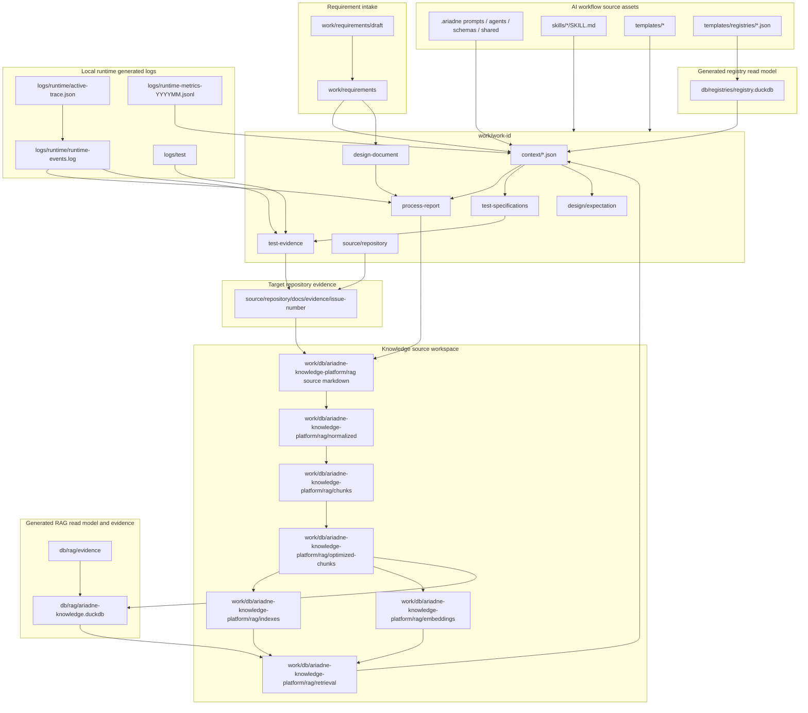
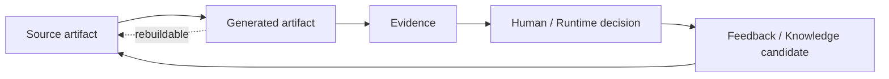
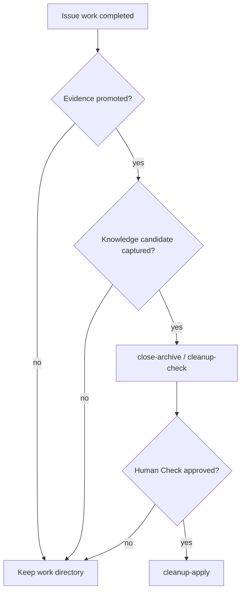

# Artifact Lifecycle Map

この文書は、Ariadne の artifact がどこで作られ、何を source of truth とし、どこまでが生成物または evidence なのかを図で示します。

詳細な保存ルールは `docs/reference/repository-structure.md`、`docs/reference/test-artifact-storage.md`、`docs/reference/rag.md`、`docs/rag/duckdb-read-model.md` を優先します。

## 全体像

## Artifact分類

| 分類 | 主な場所 | 役割 | Git管理 |
| --- | --- | --- | --- |
| AI workflow source | `.ariadne/`, `skills/`, `templates/` | Agent prompt、schema、Skill、artifact templateのsource | 管理対象 |
| Registry bootstrap source | `templates/registries/*.json` | fresh checkoutでregistry read modelを再生成するsource | 管理対象 |
| Registry read model | `db/registries/registry.duckdb` | `aiwfctl help`、Dispatcher、Human Gate、Doctorが読むruntime read model | 生成物 |
| Requirement source | `work/requirements/` | intake前の正式入力 | 運用により管理 |
| Work context | `work/<work-id>/context/*.json` | Agent / workflow 間で共有する実行context | 作業artifact |
| Process report | `work/<work-id>/process-report/` | 判断、比較、Issue draft、review、handoffの記録 | 作業artifact |
| Test specification | `work/<work-id>/test-specifications/` | UT、integration、human checkの計画 | 作業artifact |
| Test evidence | `work/<work-id>/test-evidence/` | 実行結果、ログ、スクリーンショット、人間確認 | evidence |
| Target evidence | `source/repository/docs/evidence/issue-<number>/` | target repositoryへpushする永続証跡 | target repository側で管理 |
| Runtime log | `logs/runtime/`, `logs/test/` | workflow失敗原因やtrace確認用のlocal observation source | 原則Git管理外 |
| RAG source | `work/db/ariadne-knowledge-platform/rag/...` | Knowledgeとして再利用するMarkdown / JSON source | source repository側で管理 |
| RAG generated artifacts | `normalized/`, `chunks/`, `optimized-chunks/`, `indexes/`, `embeddings/`, `retrieval/` | file-based RAG pipelineの中間・検索artifact | 再生成可能 |
| RAG read model | `db/rag/ariadne-knowledge.duckdb` | RAG sourceを検索・監査しやすくする生成read model | Git管理外 |
| RAG evidence | `db/rag/evidence/` | ingestion optimization、DuckDB migration、reference checkの証跡 | evidence |

## Source Of Truthの考え方

生成物は、判断材料として使えても source of truth ではありません。
重要な判断は、source artifact、evidence、Human Gate、Review Council verdict、Feedback report のどれに基づいたかを残します。

## Cleanup Boundary

`work/` 配下の一時artifactを削除する前に、target evidence、RAG候補、Review Council / Feedback の判断材料が必要な場所へ昇格していることを確認します。
