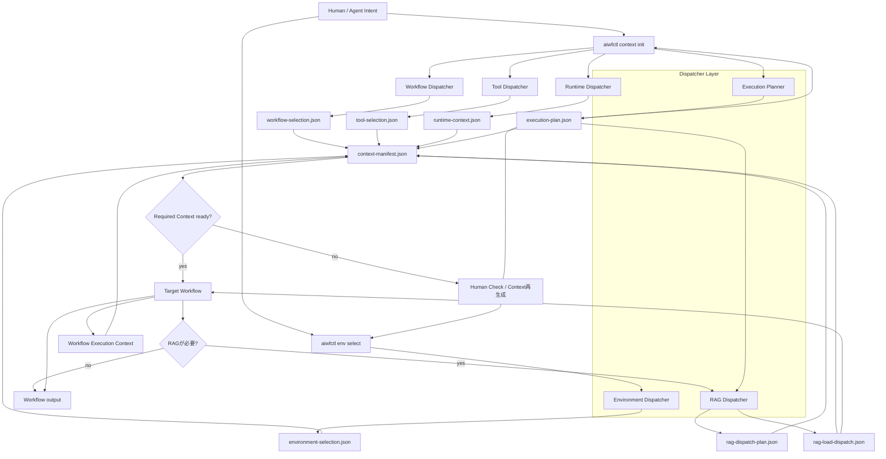
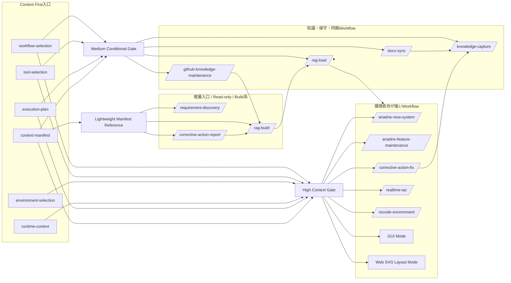
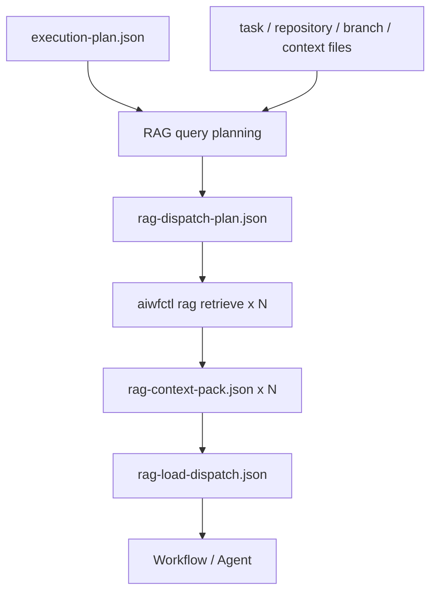
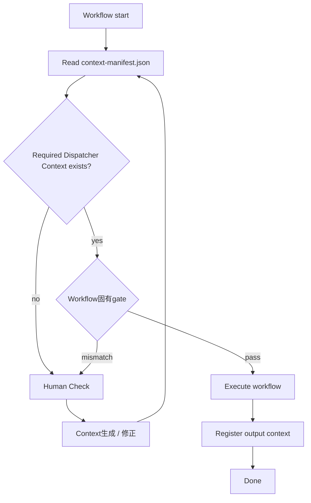

# Dispatcher / Workflow 関係図

この文書は、Context First Architecture における Dispatcher 群と各Workflowの関係をMermaidで示します。

詳細な実行手順は `docs/workflows/` と `skills/<skill-name>/SKILL.md` を優先します。この図は、Workflowへ入る前にどの判断がContext化され、Workflow中にどのContextが参照・更新されるかを掴むための入口です。

## 全体像

## Dispatcherごとの責務

| Dispatcher | 主な入口 | 出力Context | Workflowとの関係 |
| --- | --- | --- | --- |
| Workflow Dispatcher | `aiwfctl context init --workflow ...` | `workflow-selection.json` | どのWorkflowを実行するかを固定する |
| Tool Dispatcher | `aiwfctl context init --tool ...` / candidate scoring | `tool-selection.json` | `gh`、`git`、`docker`、`pytest` などの利用方針とHuman Check条件を固定する |
| Environment Dispatcher | `aiwfctl env select ...` | `environment-selection.json` | GUI / Web / Docker / VSCodeなど環境依存Workflowの前提を固定する |
| Runtime Dispatcher | `aiwfctl context init` | `runtime-context.json` | terminal、target dir、runtime modeなどの実行条件を固定する |
| Execution Planner | `aiwfctl context init --next-command ...` | `execution-plan.json` | 次command、必須Context、停止条件を固定する |
| RAG Dispatcher | `runtime/rag/rag_dispatcher.py` | `rag-dispatch-plan.json`, `rag-load-dispatch.json` | 検索query計画と取得ContextをWorkflowへ戻す |

## Workflowとの関係

## Workflow別のContext関与

| Workflow | 主に読むDispatcher Context | 主に生成・更新するWorkflow Context | 備考 |
| --- | --- | --- | --- |
| `/ariadne-new-system` | `workflow-selection`, `tool-selection`, `environment-selection`, `execution-plan` | `agent-context`, `artifact-index`, `handoff-package`, design artifacts | GUI / Web / IaC候補があるため環境判断の効果が大きい |
| `/ariadne-feature-maintenance` | `workflow-selection`, `tool-selection`, `environment-selection`, `execution-plan` | impact analysis、test evidence、workflow固有state | 既存対象システムの変更で、環境とtoolの取り違えを防ぐ |
| `/corrective-action-fix` | `workflow-selection`, `tool-selection`, `environment-selection`, `execution-plan`, `corrective-action-report` | issue work context、test evidence、knowledge-capture候補 | 改善reportから実装修正へ進むため、report所在と実行計画が重要 |
| `/realtime-iac` | `environment-selection`, `tool-selection`, `execution-plan` | IaC artifacts、validation evidence | `environment-selection.environment == docker` をgateにする |
| `/vscode-environment` | `environment-selection`, `runtime-context` | `vscode-environment-state`, `.vscode/*`候補 | self-provision / target-workspace / custom-designを分ける |
| GUI Mode | `environment-selection` | `gui-mode-state` | `environment == gui-mode` でなければ停止する |
| Web SVG Layout Mode | `environment-selection` | `web-svg-layout-state` | `environment == web-svg` でなければ停止する |
| `/docs-sync` | `workflow-selection`, `tool-selection`, `scm-state` | `docs-drift-analysis` | 新規workのanalysisでは `scm-state` を要求する |
| `/github-knowledge-maintenance` | `tool-selection`, `github-operation-gate` | `github-knowledge-analysis`, RAG candidate | mutation / RAG publish pathはHuman Check gateを確認する |
| `/knowledge-capture` | `scm-state` | `knowledge-capture`, PR材料、RAG候補 | active workはmanifest上の `scm-state` を要求し、close archiveはfallbackを許容する |
| `/rag-load` | `execution-plan` | `rag-dispatch-plan`, `rag-load-dispatch` | `--work-id` 指定時に `execution-plan` 不足ならHuman Check警告を記録する |
| `/rag-build` | 任意の `work-id` context | `rag-build-run` | RAG生成pipelineのstage結果をmanifestへ登録する |
| `/corrective-action-report` | 任意 | `corrective-action-report` | read-only調査なので環境必須化はしない |
| `/requirement-discovery` | 任意 | 完成要件、Noise Reduction結果 | work-id生成前の入口なのでContext必須化しすぎない |

## RAG Dispatcherの位置づけ

RAG Dispatcherは、Workflow選定や環境選定を行うDispatcherではありません。

RAG Dispatcherの責務は、検索前の意図、query、metadata filter、semantic hint、取得結果の集約を記録することです。

Workflow Dispatcher / Tool Dispatcher / Environment Dispatcher が「作業の実行条件」を固定するのに対し、RAG Dispatcher は「どの知識を、なぜ読むか」を固定します。

## Gateの考え方

重要なのは、Workflowが不足Contextを推測で埋めないことです。

不足している場合は、Human CheckまたはDispatcher Context生成へ戻します。これにより、Agentごとの判断揺れを抑え、後続Workflowが同じ前提を再利用できます。
