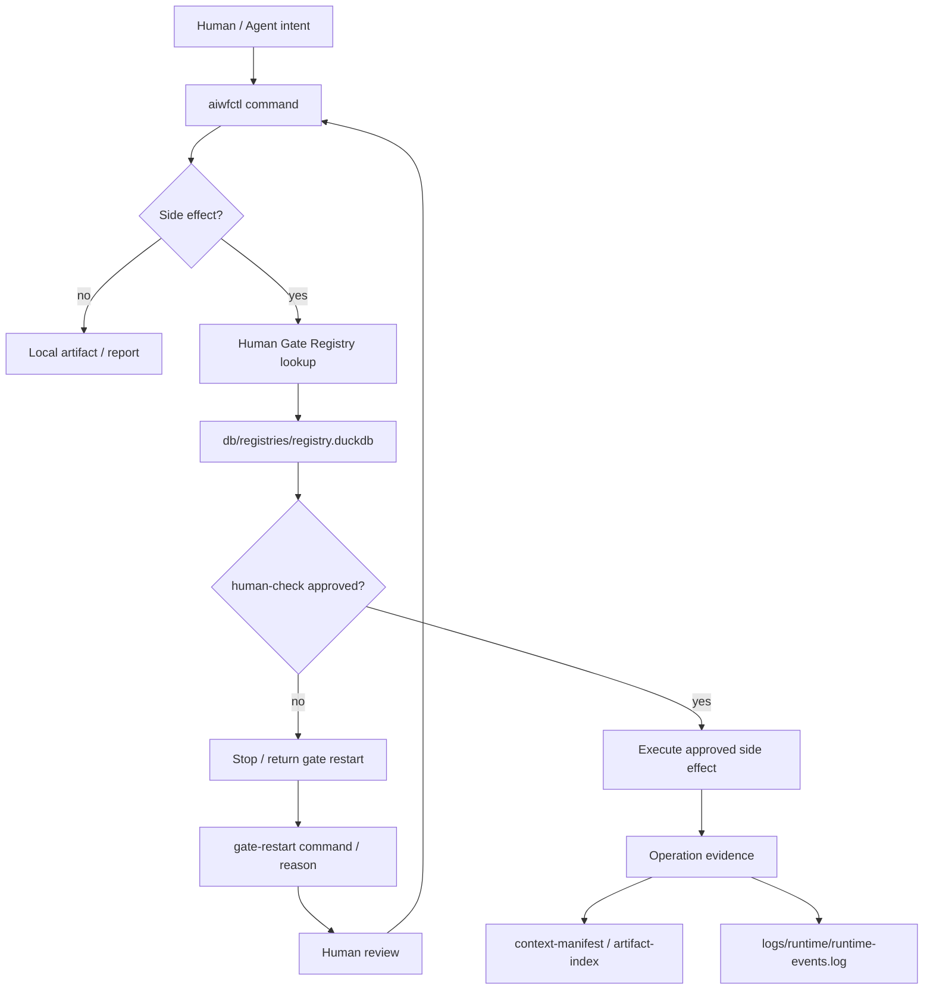
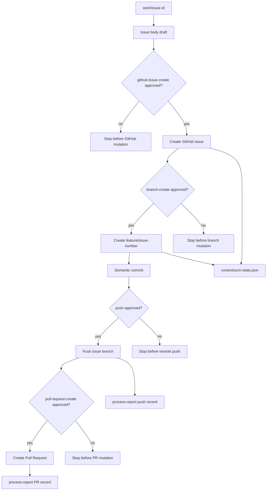
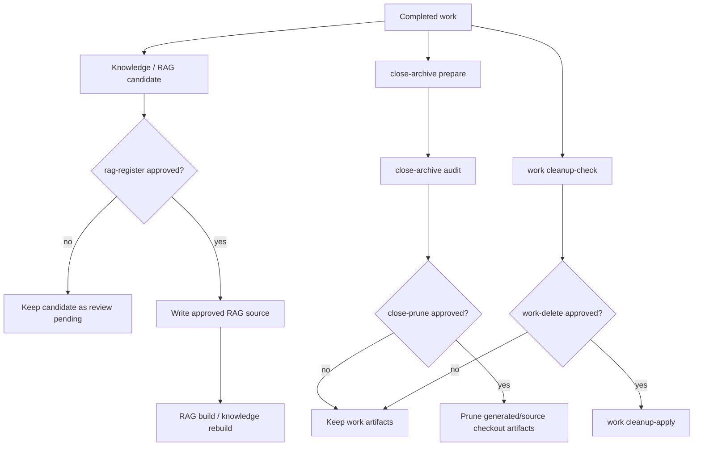
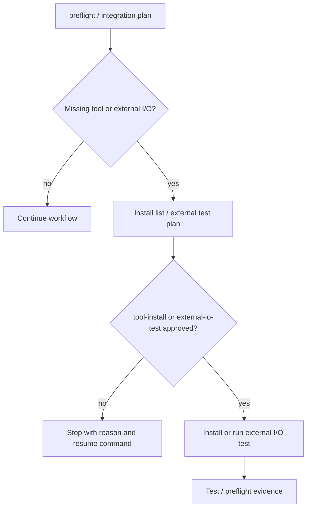
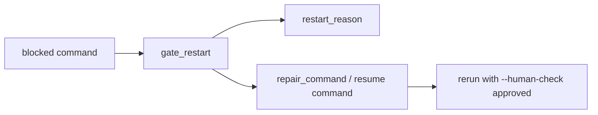

# Human Gate / Side Effect Map

この文書は、人間承認が必要な副作用操作と、その前後で残すartifactを図で示します。

詳細な承認ルールは `docs/reference/human-gates.md`、`docs/reference/operations.md`、`.ariadne/shared/gate-restart-policy.md` を優先します。

## 全体像

## 副作用操作の分類

| Gate ID | 操作 | 主な入口 | 主な証跡 |
| --- | --- | --- | --- |
| `github-issue-create` | GitHub Issue作成 | `aiwfctl github issue --create` | Issue record、Issue body、runtime event |
| `branch-create` | GitHub branch作成 | `aiwfctl scm branch` | branch record、`scm-state.json` |
| `push` | remote push | `aiwfctl scm push --human-check approved` | push record、commit hash、runtime event |
| `pull-request-create` | Pull Request作成 | `aiwfctl github pr --create` | PR title/body、PR record |
| `rag-register` | RAG登録 / rebuild | `aiwfctl rag build`, `aiwfctl knowledge rebuild` | RAG source、build run、DuckDB migration evidence |
| `close-prune` | close archive prune | `aiwfctl close-archive prune --execute` | audit result、prune result |
| `work-delete` | work削除 | `aiwfctl work cleanup-apply` | cleanup-check、cleanup-apply record |
| `tool-install` | tool / package install | `aiwfctl preflight` generated install plan | preflight report、human approval |
| `external-io-test` | 実機 / 外部I/Oテスト | startup / integration workflow | test evidence、human check result |

## GitHub副作用

GitHub上の状態を変える操作は、draft / local record を作ってから承認を確認します。
承認なしに Issue、branch、push、Pull Request を作りません。

## Knowledge / Cleanup副作用

RAG登録やcleanupは、将来のAI判断や証跡保持に影響します。
そのため、承認前は候補・監査結果として止め、承認後にだけ登録・削除します。

## External I/O / Tool Install

ローカル環境変更や外部I/Oは、runtimeが勝手に実行しません。
不足tool、実機、network、camera、field environment は、計画と停止理由を残して人間判断へ渡します。

## Gate Restart

Gateで止まることは失敗ではありません。
停止理由、再開コマンド、必要な承認値を構造化して残すことで、後続Agentや人間が同じ場所から再開できます。
