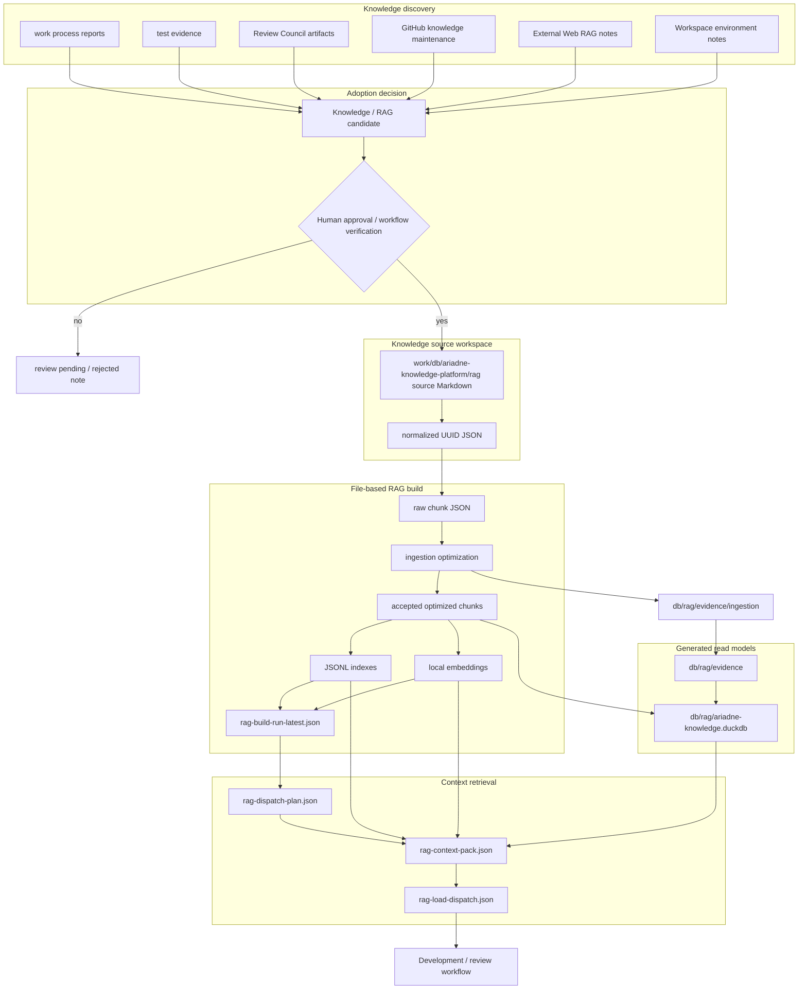
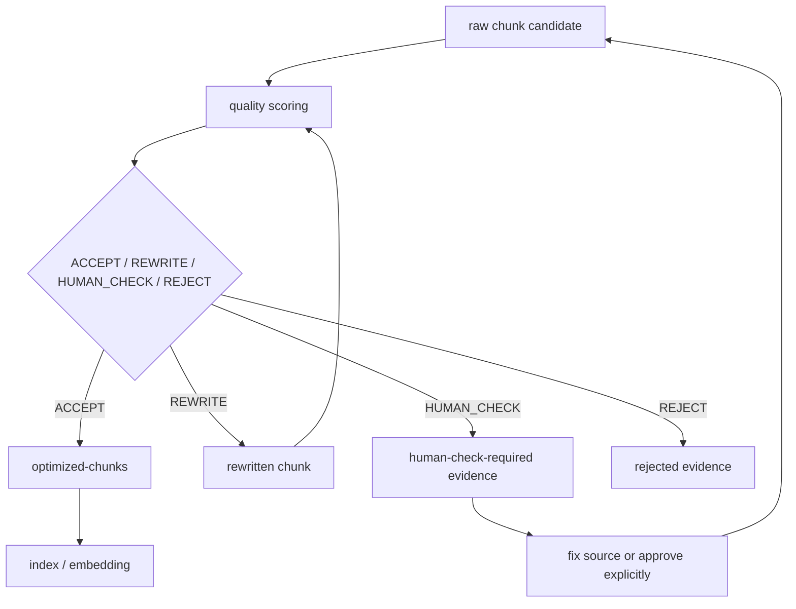
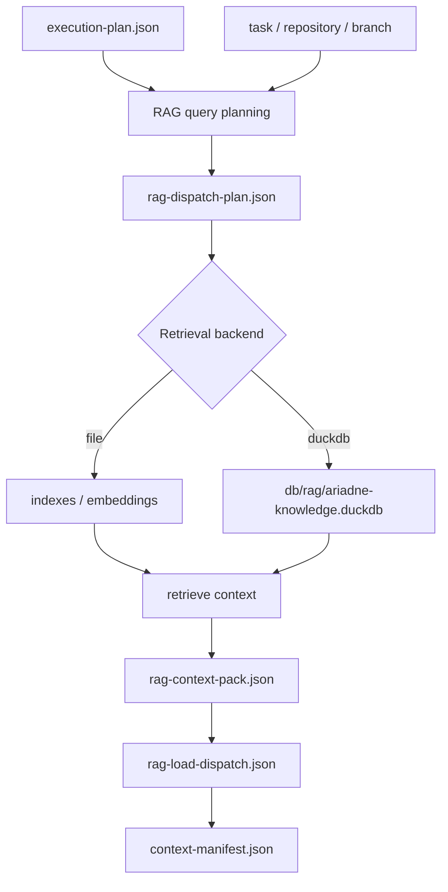
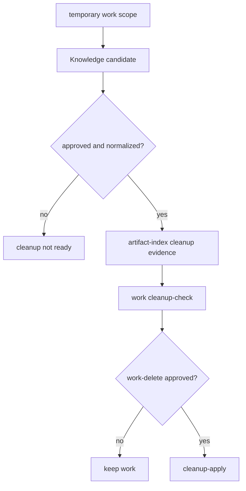

# Knowledge / RAG Lifecycle Deep Map

この文書は、作業中の発見が長期Knowledgeになり、RAG build / load / DuckDB read modelを通じて後続workflowへ戻る流れを図で示します。

詳細は `docs/reference/rag.md`、`docs/workflows/rag-build-load.md`、`docs/workflows/knowledge-capture.md`、`docs/rag/duckdb-read-model.md`、`docs/rag/knowledge-quality-metrics.md` を優先します。

## 全体像

## Knowledge source種類

| Source | 保存先 | 採用時の注意 |
| --- | --- | --- |
| Corrective Action Report | `work/db/ariadne-knowledge-platform/rag/corrective-action-report/` | finding、risk、missing test、修正判断を抽出する |
| GitHub Knowledge | `work/db/ariadne-knowledge-platform/rag/github-knowledge/` | Issue / PR / review / releaseの説明資産として扱う |
| Workspace Environment | `work/db/ariadne-knowledge-platform/rag/workspace-environment/` | VSCode / terminal / tool環境の再現知識として扱う |
| External Web | `work/db/ariadne-knowledge-platform/rag/external-web/<category>/` | URL、retrieved_at、claims、verification_notesを残し、repo evidenceを上書きしない |
| Specialist Review | `work/db/ariadne-knowledge-platform/rag/specialist-review/<domain>/` | reviewed artifact、使ったRAG、採用/不採用claim、未解決QAを残す |
| Review Council | `work/db/ariadne-knowledge-platform/rag/review-council/<work-id>/<review-id>/` | verdict、finding、evidence gate、challenge、human gateを残す |

## Absorption Quality

RAG buildは、Markdownをそのまま検索indexへ流しません。
`ingestion optimization` で意味のまとまり、traceability、metadata、重複、曖昧さを評価し、`ACCEPT` 済みchunkだけを通常のindex / embedding対象にします。

## Load / Dispatch

`rag-load` は検索結果だけでなく、「なぜそのqueryで検索したか」を `rag-dispatch-plan` に残します。
後続workflowは、context packの内容だけでなく検索意図も確認します。

## Cleanupとの関係

`chunks`、`optimized-chunks`、`indexes`、`embeddings`、`retrieval` は再生成可能な派生成果物です。
cleanup可否の根拠にする場合は、承認済みsourceまたは normalized JSON が `artifact-index.json` に記録されている必要があります。
