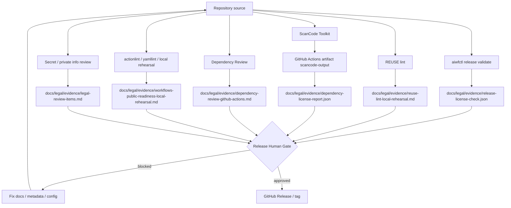
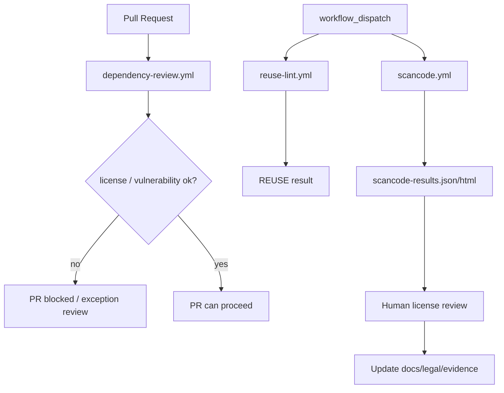
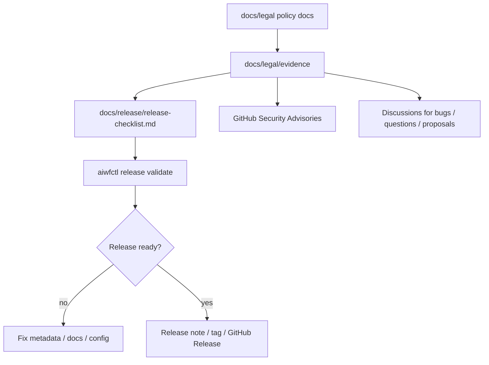
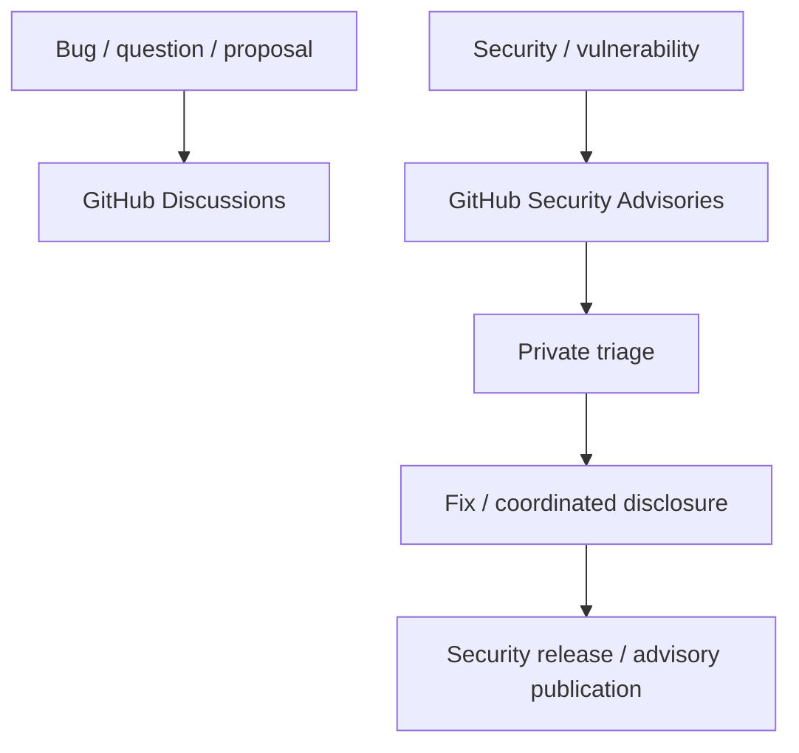
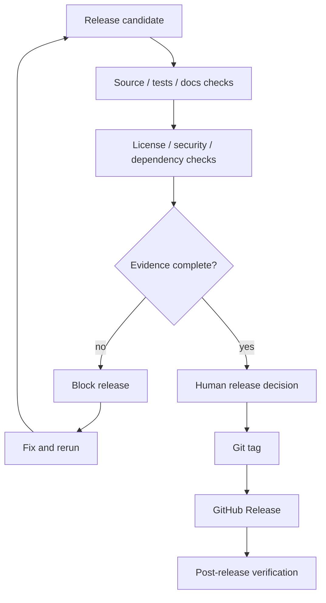

# OSS Release Audit Map

この文書は、OSS releaseや継続運用時に行うlicense / security / dependency auditと、その証跡がどこへ集約されるかを図で示します。

詳細は `docs/legal/README.md`、`docs/release/release-checklist.md`、`docs/security/scancode-github-actions.md`、`.github/workflows/` を優先します。

## 全体像

## Audit sources

| Audit | 主な入口 | 主な確認内容 | 主な証跡 |
| --- | --- | --- | --- |
| Release validation | `aiwfctl release validate --json` | license方針、release readiness、metadata整合 | `release-license-check.json`、release manifest |
| REUSE lint | local rehearsal / `.github/workflows/reuse-lint.yml` | SPDX metadata、license file、copyright |
| ScanCode | `.github/workflows/scancode.yml` | repository内license / copyright検出 |
| Dependency Review | `.github/workflows/dependency-review.yml` | PR差分dependencyのlicense policy / vulnerability |
| Workflow audit | `actionlint`, `yamllint`, local rehearsal | GitHub Actions構文、workflow_dispatch、設定整合 |
| Human legal review | `docs/legal/evidence/legal-review-items.md` | GitHub Security Advisories、連絡先、公開URL、copyright holder |
| Secret review | release checklist / manual review | token、private URL、顧客固有情報、非公開project情報 |

## GitHub Actions audit

Dependency ReviewはPR差分の監査です。
ScanCodeとREUSE lintはrelease前または継続監査として手動実行し、結果を人間が確認してevidenceへ反映します。

## Legal evidence flow

Policy documentは方針を説明する文書です。
`docs/legal/evidence/` は、あるrelease candidateや継続監査時点の確認状態を残す場所です。

## Contact and vulnerability handling

一般のバグ報告・質問・提案は Discussions で受けます。
セキュリティ・脆弱性連絡は GitHub Security Advisories で受け、公開Issueで詳細を扱いません。

## Release gate

Release Gateは、CIが通ったことだけではなく、release checklist、legal evidence、security contact、dependency/license audit、documentationが揃っていることを確認します。
