# Workflow Flowcharts

各AI workflowの動作イメージを掴むためのMermaid式flowchartです。

詳細手順は `docs/workflows/` と `skills/<skill-name>/SKILL.md` を優先します。

## Requirement Discovery

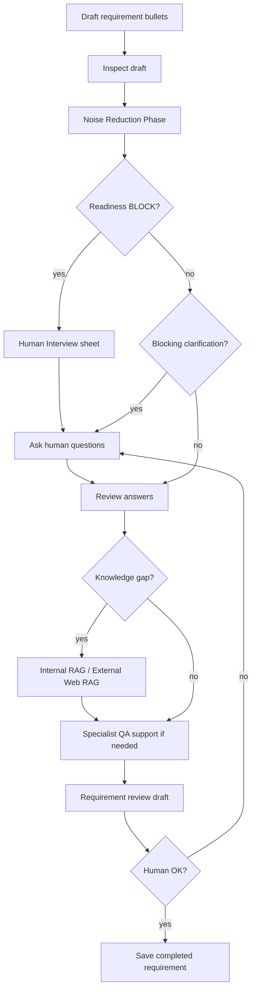

## Ariadne New System

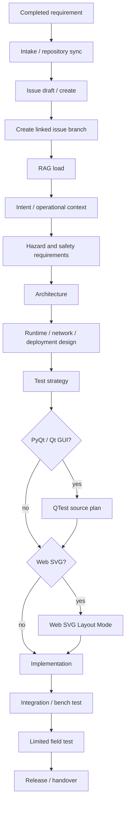

## Ariadne New System + Realtime IaC

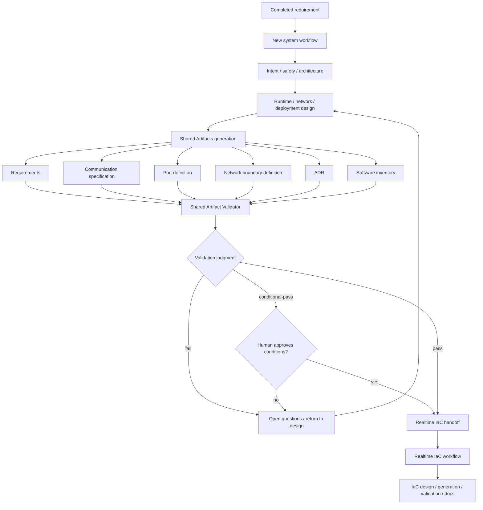

## Ariadne Feature Maintenance

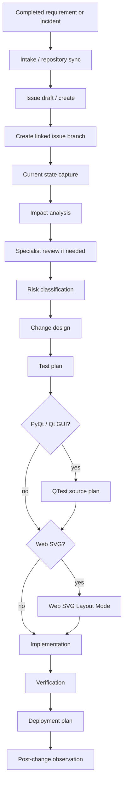

## Corrective Action Report

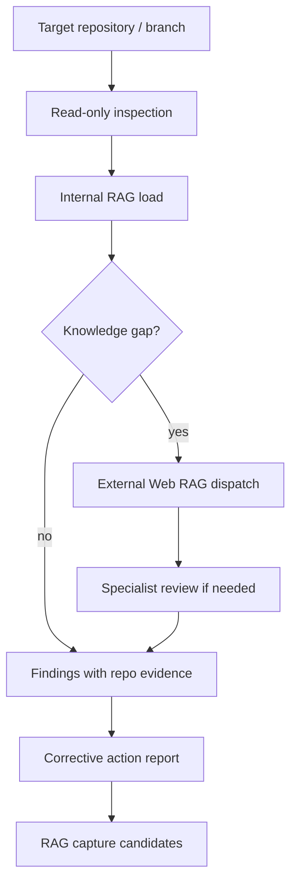

## Review Council Runtime

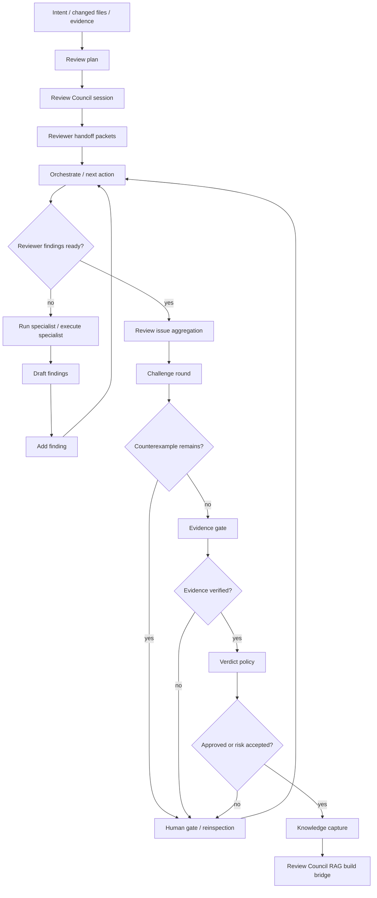

## Expectation-Driven Design Flow

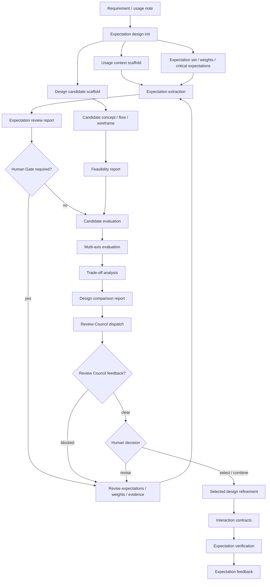

## Runtime Observability / Trace

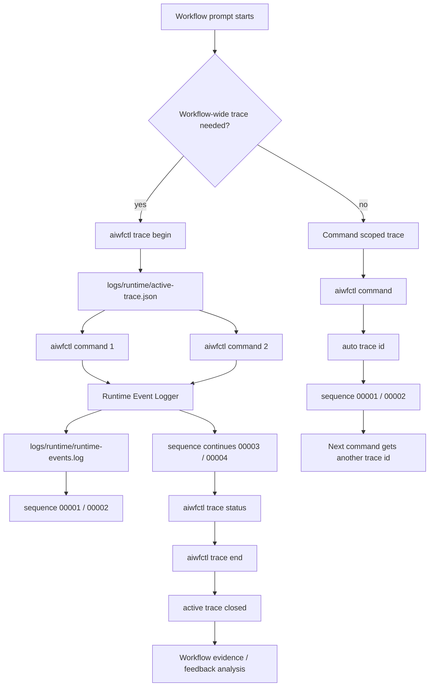

## Realtime IaC

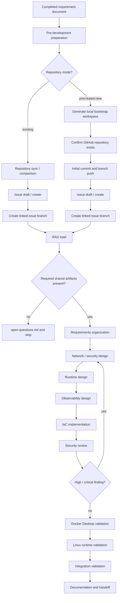

## Corrective Action Fix

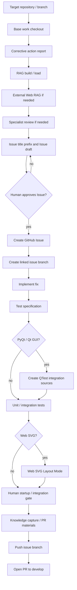

## Docs Sync

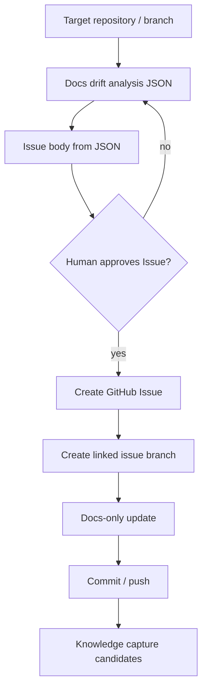

## GitHub Knowledge Maintenance

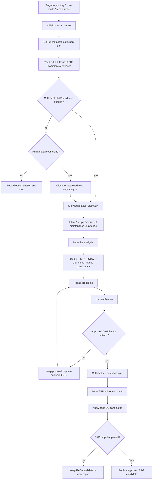

## VSCode Environment

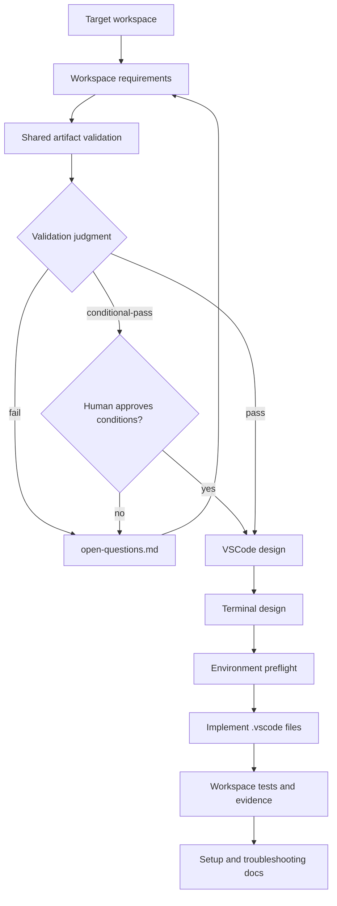

## Knowledge Capture

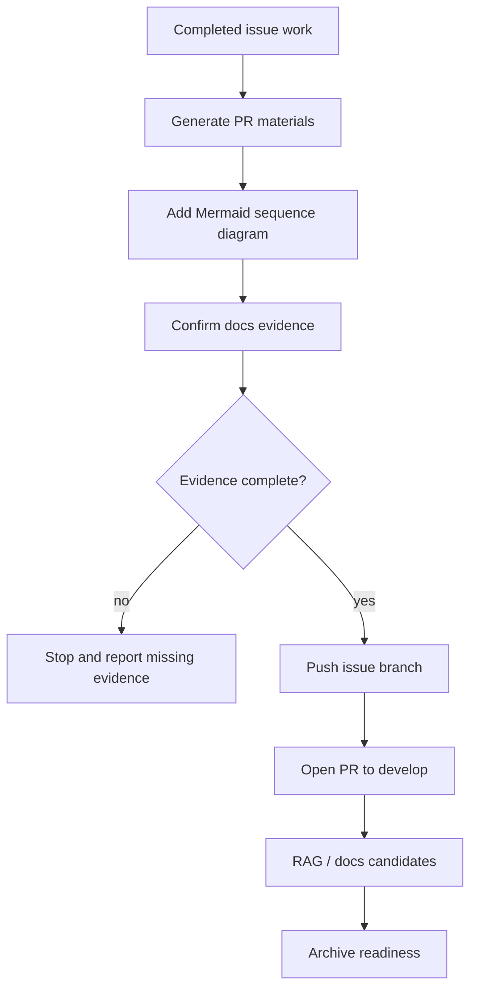

## RAG Build / Load

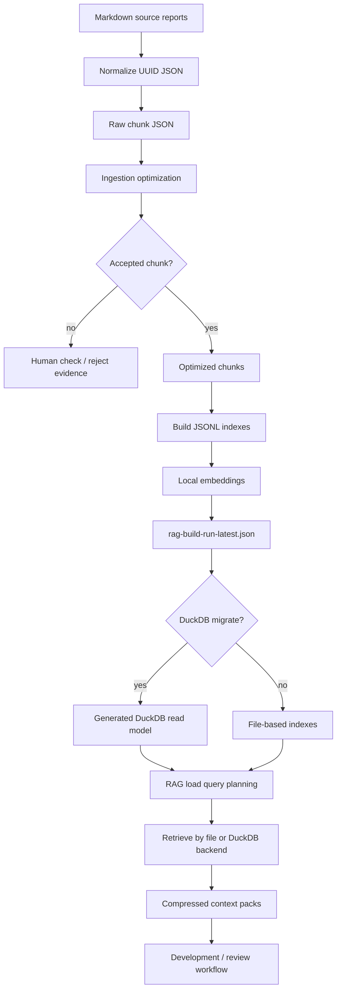

## External Web RAG

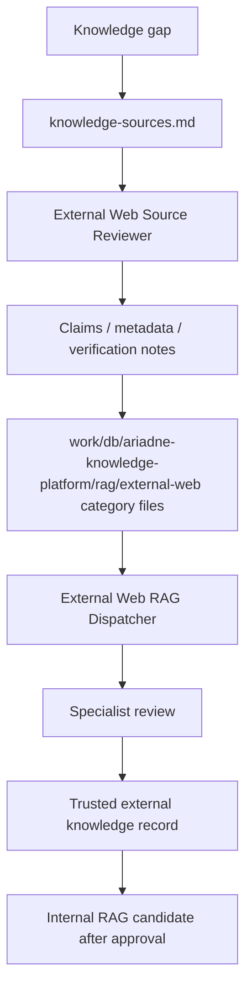
