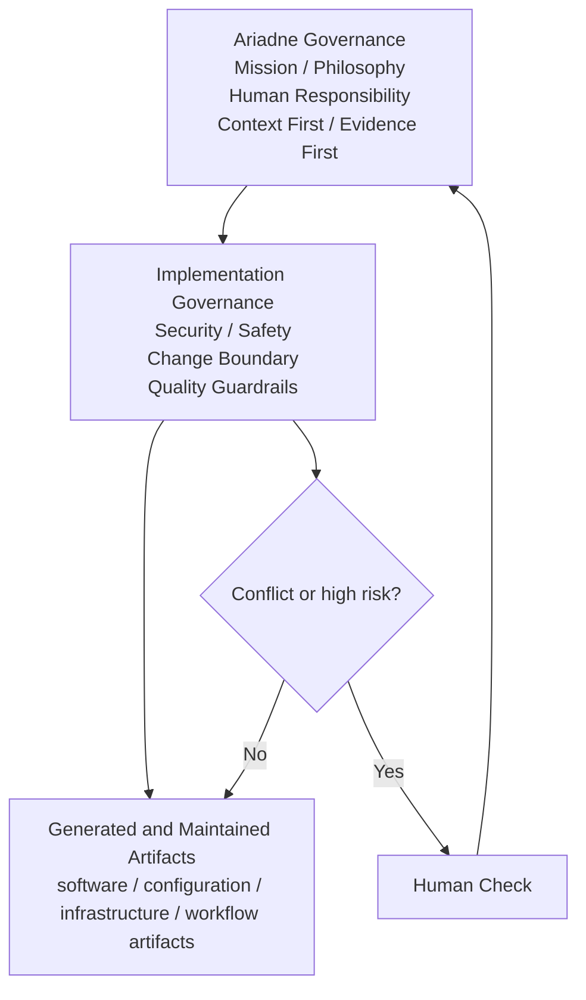
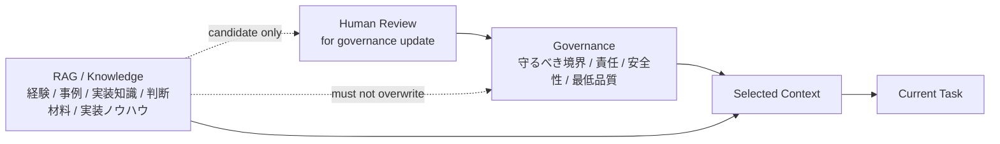
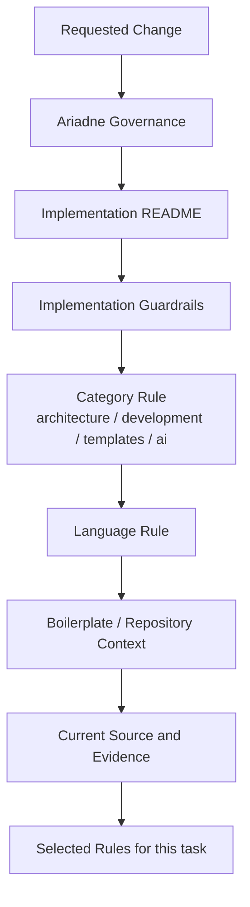
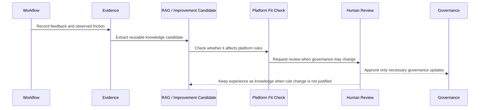

# Implementation Governance

Implementation Governance は、Ariadne AI Workflow Platform が生成、変更、保守する成果物に適用する実装規範の入口です。

ここでは Ariadne 自身の Mission、Philosophy、責任境界、自己改善方針は定義しません。それらは上位の [Ariadne Governance](../ariadne/README.md) で管理します。

Implementation Governance は、その上位方針を、実際の software、boilerplate、configuration、infrastructure、workflow artifact へ適用するための境界と判断基準を提供します。

## 目的

この文書群の目的は、実装方法を細部まで固定することではありません。成果物の種類や technology stack が増えても、人間と AI Agent が安全に変更できる状態を維持することです。

特に次を守ります。

* 変更してよい範囲と、変更してはいけない範囲を明確にする。
* secret、外部 I/O、副作用、権限、依存関係を安全に扱う。
* 実装理由、検証結果、未検証事項、残存リスクを後続作業者が確認できる形で残す。
* 言語や framework 固有の経験知と、platform として守る規範を混同しない。
* 成果物の特性に応じて、必要な規範だけを選択的に参照できるようにする。

## Ariadne Governance との関係

Ariadne Governance は、Ariadne 自身がどのような思想と責任境界で運営、改善されるかを定義します。

Implementation Governance は、その思想を成果物の実装へ適用します。両者が矛盾する場合は Ariadne Governance を優先し、必要に応じて Human Check を行います。



## Governance と Knowledge の境界

Implementation Governance には、成果物として必ず守るべき規範を記載します。

例:

* secret を source code、log、Evidence、prompt へ出力しない。
* 外部公開、権限変更、破壊的操作を Human Check なしに実行しない。
* 入力値、外部データ、configuration を信頼済みとして扱わない。
* 変更対象外の責務を暗黙に変更しない。
* 検証未実施を成功として扱わない。
* Evidence を残さずに重大な変更を完了扱いにしない。

一方、次のような内容は原則として RAG、technology docs、boilerplate docs、または project 固有 Context で管理します。

* 特定 framework の実装例。
* 過去の障害事例。
* library や tool の使用例。
* performance tuning の経験。
* 特定 repository だけに有効な設計判断。
* 一時的または技術依存性の高い best practice。

経験知を直ちに規範へ昇格させません。規範として追加するのは、security、safety、responsibility、platform integrity、law、license、品質保証など、platform 全体で守る必要がある内容に限ります。



## 適用対象

Implementation Governance は、Ariadne が生成、変更、保守する次の成果物へ適用します。

* Application source code。
* CLI、runtime helper、script。
* API、batch、worker、gateway。
* Web、desktop、mobile application。
* Docker、Kubernetes、IaC。
* configuration、schema、migration。
* boilerplate template。
* test、fixture、mock。
* CI/CD configuration。
* AI Agent prompt、workflow artifact。
* documentation、report、Evidence。

すべての成果物が、すべての規範を毎回読む必要はありません。成果物の種類、使用言語、実行環境、外部接続、security impact、変更 scope に応じて必要な文書を選択します。

## Directory 構成

```text
implementation/
├── README.md
├── implementation-guardrails.md
├── architecture/
│   ├── dependency-rules.md
│   ├── module-boundary.md
│   ├── repository-layout.md
│   ├── runtime-rules.md
│   ├── dispatcher-rules.md
│   └── rag-rules.md
├── development/
│   ├── coding-rules.md
│   ├── naming-rules.md
│   ├── error-handling.md
│   ├── logging-rules.md
│   ├── configuration.md
│   ├── testing-rules.md
│   └── security.md
├── templates/
│   ├── boilerplate-rules.md
│   ├── github-template.md
│   ├── docker-template.md
│   ├── flutter-template.md
│   ├── nextjs-template.md
│   ├── go-template.md
│   └── python-template.md
├── ai/
│   ├── ai-development-rules.md
│   ├── human-check.md
│   ├── evidence-rules.md
│   ├── runtime-contract.md
│   └── prompt-guidelines.md
└── languages/
    ├── python.md
    ├── go.md
    ├── typescript.md
    ├── shell.md
    ├── dart.md
    └── powershell.md
```

この構成は、空の分類を維持するためのものではありません。成果物、boilerplate、technology stack の増加に応じて段階的に整理します。

## 文書の責務

`implementation-guardrails.md` は、すべての成果物へ適用する最上位の実装規範です。security、変更境界、検証、Evidence、Human Check、secret handling など、言語や framework に依存しない内容を扱います。

`architecture/` は、成果物側の構造境界を定義します。Ariadne Platform 自身の設計原則ではなく、生成・変更される成果物の dependency、module boundary、runtime、dispatcher、repository layout、RAG boundary を対象にします。

`development/` は、日常的な実装で守る共通規範を扱います。coding、naming、logging、error handling、configuration、testing、security など、どの成果物でも反復して参照する内容です。

`templates/` は、boilerplate template の最低要件、構成、拡張方針、完成条件を定義します。template 固有の実装知識をすべて規範化するのではなく、品質を維持するための共通条件を中心に扱います。

`ai/` は、AI Agent が成果物を生成、変更、検証するときの契約を定義します。Human Check、Evidence、変更 scope、停止条件、prompt、runtime contract を扱います。

`languages/` は、言語固有の安全性、標準 tool、format、lint、test、例外処理を定義します。言語別規範は、言語 Tips や好みの実装スタイルを集めるための文書ではありません。各言語で発生しやすい security issue、vulnerability、unsafe side effect、secret leakage、検証不能な実装を防ぐための最低規範です。一般的な技術解説や経験知はここへ大量に書かず、必要に応じて RAG または technology docs を参照します。

## AI Agent の参照順序

AI Agent は、原則として次の順で規範を選択します。



すべての文書を常に Context へ投入する必要はありません。Dispatcher または workflow が、成果物の種類、言語、risk、変更 scope に応じて必要な規範を選択します。

## 運用方針

Implementation Governance は、次の方針で維持します。

* 規範は最小限かつ明確に保つ。
* 同じ内容を複数文書へ重複させない。
* MUST、SHOULD、MAY を区別する。
* MUST は security、safety、responsibility、platform integrity、再現性、品質保証などに限定する。
* 技術の選好や経験知を安易に MUST へしない。
* rule 追加時は、どの失敗を防ぐための規範かを明確にする。
* 自動検証可能な内容は、lint、test、schema、policy check へ移す。
* 人間の注意力だけに依存する規範を増やしすぎない。
* obsolete な規範は Human Review を経て更新または廃止する。

## Self-Improvement Workflow との関係

Self-Improvement Workflow は、成果物や boilerplate に関する feedback を扱うとき、Implementation Governance を参照します。

ただし、feedback や経験知を自動的に規範へ追加しません。まず Evidence として保存し、RAG または Improvement Candidate として扱い、Platform Fit Check と Human Review を経て、必要な場合だけ Governance を更新します。



Governance 変更は、通常の knowledge 追加よりも強い Human Check を必要とします。

## まとめ

* Implementation Governance は、Ariadne が生成、変更、保守する成果物の実装規範である。
* Ariadne 自身の思想と責任境界は、上位の Ariadne Governance で管理する。
* Governance は安全、責任、変更境界、最低品質を扱い、経験知は主に RAG で管理する。
* すべての rule を常時読むのではなく、成果物と risk に応じて必要な文書を選択する。
* boilerplate や technology stack が増えても、共通の安全性と品質基準を維持する。
