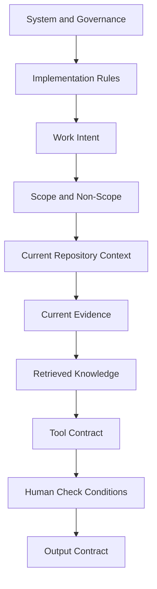
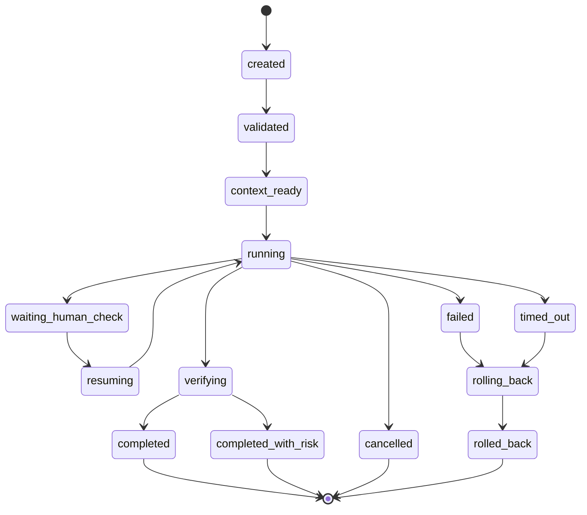
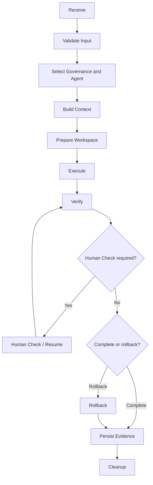
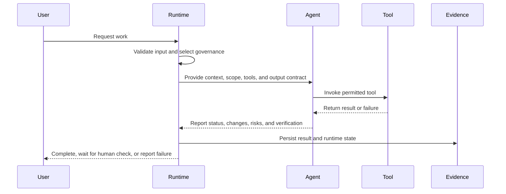

# AI Runtime Contract

この文書は、AI Agent を実行する Runtime と、AI Agent、workflow、tool、人間の間で成立する実行契約を定義します。

Runtime は、prompt を model へ渡すだけの process ではありません。

Context を準備し、Governance を適用し、tool access を制御し、Human Check で停止し、Evidence を保存し、処理状態を管理する実行基盤です。

## 目的

* Runtime の責務と非責務を明確にする。
* AI Agent への入力と期待する出力を定義する。
* tool、permission、side effect を制御する。
* Human Check と resume を安定して扱う。
* failure、cancel、timeout、recovery を定義する。
  * 同じ work を再現、再開、監査できるようにする。

## Runtime Responsibility

Runtime は次を担います。

* work受付。
* work-id 生成または検証。
* Context assembly。
* Governance selection。
* Agent selection。
* tool capability提供。
* permission enforcement。
* state 管理。
* timeout と cancel。
* Human Check 停止。
* resume。
* Evidence 保存。
* completion 判定。
* cleanup。
* process report 生成。

Runtime の非責務:

* business目的の決定。
  * 最終承認。
* risk受容。
* Agentの全判断の代替。
* Governance 変更の自動承認。
  * 成果物内容の無条件な正当化。

## Runtime Input Contract

Runtime input には、必要に応じて次を含めます。

* work-id。
* intent。
* requested operation。
* target repository。
* target environment。
* scope。
* non-scope。
* acceptance criteria。
* risk classification。
* permitted tools。
* permitted side effects。
* required Governance。
* required Human Check。
* Context references。
* Evidence output。
* timeout。
* resume information。

### MUST

* input schema を定義する。
* required field を validation する。
* target path、repository、environment を検証する。
* untrusted instruction を区別する。
* secret を通常 input へ含めない。
* side effect permission を明示する。
* default で production mutation を許可しない。

## Runtime Context

Runtime が Agent へ渡す Context は、次の順序を基本とします。



### MUST

* Governance と reference knowledge を区別する。
* current evidence を古い RAG より優先する。
* Context source を追跡可能にする。
* 不要な全文を無制限に投入しない。
* secret や restricted information を filter する。
* conflicting information を明示する。
* Context budget を管理する。

## Runtime State

Runtime は少なくとも次の state を扱います。



### MUST

* state transition を明示する。
* 不正な transition を拒否する。
* current state を観測可能にする。
* state change を Evidence へ記録する。
* waiting-human-check 中に operation を進行しない。
* completed 後に無断で再実行しない。

## Runtime Lifecycle





### MUST

* validation 前に副作用を開始しない。
* workspace準備前に target へ変更を加えない。
* verification 前に完了判定しない。
* Evidence 保存前に workspace を破棄しない。
* failure path でも cleanup と Evidence 生成を試みる。

## Workspace Contract

Runtime は workspace について次を明確にします。

* root path。
* source repository。
* branch または worktree。
* writable scope。
* temporary area。
* Evidence area。
* generated artifact area。
* cleanup policy。
* reuse policy。

### MUST

- 対象 repository を確認する。

* writable scope 外へ変更しない。
* previous workの残存物を検出する。
* reuse 時は work-id と状態を確認する。
* uncommitted change を無断で破棄しない。
* path traversal を防止する。
* cleanup 前に必要 artifact を保存する。

## Agent Contract

Runtime は Agent へ次を提供します。

- 明確な Intent。

* Scope。
* Non-Scope。
* applicable rules。
* available tools。
* permission。
* Context。
* output schema。
* stop conditions。
* Evidence location。

Agent は Runtime へ次を返します。

* status。
* summary。
* changed artifacts。
* verification result。
* tool usage。
* Human Check request。
* failure。
* remaining risks。
* improvement candidates。
* Evidence references。

## Tool Contract

各 tool には次を定義します。

* identifier。
* capability。
* input schema。
* output schema。
* side effect。
* permission。
* timeout。
* retry。
* supported environment。
* failure contract。
* audit requirement。

### MUST

* tool capability を最小化する。
* read と write を区別する。
* destructive tool を default で無効化する。
* command、path、URL を validation する。
* tool output を無条件に信頼しない。
* tool invocation を Evidence へ記録する。
* secret を argument や output へ露出しない。

## Permission Model

Runtime permission は、少なくとも次を区別します。

* read repository。
* write workspace。
* execute local command。
* install dependency。
* network access。
* external read。
* external mutation。
* Git commit。
* Git push。
* merge。
* infrastructure mutation。
* production access。
* secret access。

### MUST

* permission は deny by default とする。
* work単位で必要な permissionだけを付与する。
* Agent が自分の permission を拡張できないようにする。
* Human Check 後も承認された permissionだけを付与する。
* permission利用を監査可能にする。

## Human Check and Resume

Runtime が Human Check へ移行する際、次を保存します。

* current state。
* completed steps。
* pending operation。
* operation parameters。
* workspace state。
* verification result。
* request content。
* expiration。
* resume token または identifier。

### MUST

* resume 時に承認 scope を再検証する。
* workspace が変更されていないか確認する。
* approval expiration を確認する。
* parameter差異がある場合は再承認する。
  * 同じ operation を二重実行しない。
* resume 後の結果を同じ work Evidence へ接続する。

## Timeout and Cancellation

### MUST

* Runtime 全体と toolごとに timeout を定義する。
* cancel request を Agent と child process へ伝播する。
* timeout 後に process が残らないようにする。
* partial state を確認する。
* cancellation を failure と区別する。
* timeout または cancelの Evidence を残す。

## Retry

### MUST

* retry対象を限定する。
* retry count を制限する。
  * 同じ副作用を二重実行しない。
* Agent response が不十分なだけで全作業を無条件に再実行しない。
* retry reason を記録する。
* retry exhaustion 後の状態を定義する。

## Recovery

Runtime は次の recovery を必要に応じて提供します。

* workspace reuse。
* checkpoint resume。
* Evidence-based restart。
* rollback。
* clean restart。
* manual recovery。

### MUST

* recovery対象 work を識別する。
* last consistent state を確認する。
* partial mutation を検出する。
* old Context を無条件に再利用しない。
* Governance や source 更新を確認する。
* recovery 結果を Evidence へ記録する。

## Completion Contract

Runtime は次が満たされた場合にのみ `completed` とします。

* acceptance criteria 確認。
* required artifact存在。
* required verification完了。
* required Human Check 完了。
* Evidence 保存。
* secret 確認。
* remaining risk整理。
* cleanup または workspace保持方針確定。

### MUST

次の場合は `completed` にしません。

* test failure。
* verification 未実施。
* Human Check 待ち。
* artifact不明。
* Evidence 不明。
* partial mutation未確認。
* timeout。
* required permission不足。
* Agent responseのみで実成果物を確認していない。

## Output Contract

Runtime output には必要に応じて次を含めます。

```json
{
 "work_id": "issue-123",
 "status": "completed",
 "summary": "Configuration validation was added.",
 "changed_artifacts": [],
 "verification": [],
 "human_check": {},
 "evidence": [],
 "remaining_risks": [],
 "improvement_candidates": []
}
```

### MUST

* output schema version を管理する。
* human-readable summary と machine-readable result を整合させる。
* file path と artifact を追跡可能にする。
* secret を含めない。
* failure 時も構造化 output を返す。

## Observability

Runtime は必要に応じて次を観測可能にします。

* current state。
* Agent。
* selected Governance。
* Context sources。
* tool invocation。
* Human Check。
* timeout。
* retry。
* failure。
* token または resource usage。
* artifact count。
* completion result。

## Security

### MUST

* prompt injection を含む untrusted Context を区別する。
* Agent へ不要な secret access を与えない。
* tool permission を Context 上の命令で変更させない。
* external content からの command を自動実行しない。
* workspace を他 work から分離する。
* Evidence へ secret を残さない。
* Runtime configuration 変更を Human Check 対象とする。

## Runtime Versioning

### MUST

* Runtime version を Evidence へ記録する。
* Agent、prompt、schema、tool version を必要に応じて記録する。
* breaking change を識別する。
* resume対象と Runtime versionの compatibility を確認する。
* old workの recovery方針を定義する。

## まとめ

* Runtime は Context、permission、state、Human Check、Evidence を管理する実行基盤である。
* Agent へ無制限の tool access や side effect を許可しない。
* work-id を中心に workspace、state、approval、Evidence を接続する。
* validation、verification、Human Check 完了前に completed としない。
* failure、timeout、cancel、recovery を正式な state として扱う。
