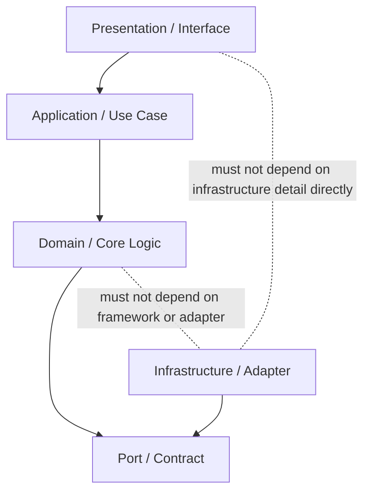

# Dependency Rules

この文書は、Ariadne AI Workflow Platform が生成、変更、保守する成果物における dependency の方向、追加、公開、更新、削除に関する規範を定義します。

dependency は、package や libraryの追加だけを意味しません。

次を含みます。

* module間 dependency。
* layer間 dependency。
* repository間 dependency。
* runtime component間 dependency。
* external service dependency。
* package、SDK、CLI、container image。
* schema、protocol、configuration dependency。
* build、test、deployment tool への dependency。

## 目的

Dependency Rulesの目的は、dependency を禁止することではありません。

次の状態を維持します。

* dependency の方向が理解できる。
* module や technologyの変更が全体へ無秩序に波及しない。
* external service や toolの停止時に影響を判断できる。
  * 不要な dependency を増やさない。
* security、license、runtime risk を確認できる。
* replacement、upgrade、removal が可能な構造を保つ。

## Dependency Direction

### MUST

* dependency の方向を architecture上で明確にする。
* lower-level component が、理由なく higher-level orchestration へ依存しない。
* domain rule が presentation、CLI、database、framework へ直接依存しない。
* shared module が特定 featureの詳細へ依存しない。
* circular dependency を作らない。
* public contract を経由せず、他 moduleの internal implementation へ依存しない。
* test から production dependency direction を逆転させない。

### SHOULD

基本的な方向は次を推奨します。

成果物に layered architecture を採用しない場合でも、次を明確にします。

* 誰が誰を呼ぶか。
* 誰が contract を所有するか。
* 誰が technology detail を知るか。
* dependency をどこで差し替えるか。

## Dependency Ownership

### MUST

* dependency を利用する moduleの責務を明確にする。
* 複数 module が直接同じ external dependency へ無秩序に接続しない。
* external SDK や framework 固有 type を domain全体へ拡散させない。
* dependency 追加理由を説明できるようにする。
* dependency の source of truth を明確にする。

### SHOULD

* external dependency は adapter または integration boundary へ閉じ込める。
* technology 固有 type は内部 type へ変換する。
* dependency wrapper を作る場合は、単なる全 API転送にしない。
* organization全体の共通 module 化は、十分な共通責務がある場合に限定する。

## Adding Dependencies

### MUST

dependency を追加する前に、次を確認します。

* 解決する課題。
* 標準機能または既存 dependency で代替できない理由。
* maintenance状態。
* versioning方針。
* license。
* known vulnerability。
* transitive dependency。
* runtime size と resource影響。
* build、deployment、distribution への影響。
* offline または restricted environment での利用可否。
* removal または replacementの難易度。

### MUST NOT

* 一時的な便利さだけを理由に大規模 dependency を追加しない。
* package 名だけで取得元を信頼しない。
* version を無制限な latest へ依存させない。
* deprecated または unsupportedな dependency を新規採用しない。
* 同じ目的の library を複数追加しない。

## Version Management

### MUST

* dependency version を再現可能な形で管理する。
* lock file または同等の version固定機構を適切に使用する。
* major version 更新では breaking change を確認する。
* security update を無期限に放置しない。
* runtime と build 時 dependency を区別する。
* development-only dependency を production artifact へ不要に含めない。

### SHOULD

* version range を広げすぎない。
* dependency update を小さな単位で実施する。
* update 時に release note、migration guide、security advisory を確認する。
* automated update を採用する場合も Human Review を維持する。

## External Services

### MUST

external service へ依存する場合、次を定義します。

* endpoint。
* authentication。
* timeout。
* retry。
* rate limit。
* availability expectation。
* failure behavior。
* fallback。
* data classification。
* cost。
* test strategy。
* local development strategy。

external serviceの停止を、application全体の不明な failure へ変換しません。

### SHOULD

* circuit breaker、queue、cacheなどを risk に応じて検討する。
* provider 固有仕様を application全体へ広げない。
* emulator、fake、mock server を利用可能にする。
* service replacement を妨げる密結合を避ける。

## Shared Dependencies

### MUST

* shared module へ配置する責務を明確にする。
* `common`、`utils`、`shared` へ無秩序に処理を集めない。
* shared dependency が全 module へ不要な transitive dependency を持ち込まない。
* feature 固有 logic を shared 化しない。
* shared moduleの変更影響を確認する。

### SHOULD

shared 化の判断基準:

* 同じ意味を持つ。
* 同じ変更理由を持つ。
* 複数箇所で安定して利用される。
* domain boundary を壊さない。
* technology依存を不必要に拡散しない。

## Cyclic Dependencies

### MUST

circular dependency を検出した場合、次を見直します。

* module responsibility。
* contract ownership。
* shared abstraction。
* event または message boundary。
* orchestration位置。
* data modelの共有範囲。

circular dependency を build設定や dynamic importだけで隠しません。

## Dependency Removal

### MUST

dependency 削除時は次を確認します。

* source code参照。
* build script。
* test。
* configuration。
* container image。
* CI/CD。
* documentation。
* license notice。
* generated artifact。
* transitive dependency。
* RAG または template metadata。

### SHOULD

* unused dependency を定期的に検出する。
* replacement完了後に old dependency を残さない。
* deprecated dependency には removal plan を持つ。

## AI Agent 向け規範

AI Agent は dependency 変更時に次を確認します。

1. 追加または変更理由。
2. dependency direction。
3. existing alternative。
4. security と license。
5. version。
6. transitive dependency。
7. runtime impact。
8. test。
9. deployment。
10. rollback または removal方法。

AI Agent は package 追加を、実装開始時の自動的な初手にしません。

## Evidence

dependency 変更の Evidence には、必要に応じて次を含めます。

* package または service 名。
* version。
* purpose。
* source。
* license。
* security 確認。
* affected modules。
* verification result。
* migration。
* rollback。
* residual risk。

## まとめ

* dependency は packageだけでなく、module、service、schema、tool を含む。
* dependency direction と ownership を明確にする。
* external technology detail を core logic へ拡散させない。
* dependency 追加時は security、license、maintenance、removal を確認する。
* circular dependency や shared moduleの肥大化を許容しない。

