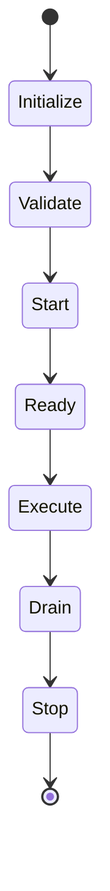

# Runtime Rules

この文書は、生成・保守される成果物における runtime の起動、停止、状態、resource、failure、recovery、observability に関する規範を定義します。

ここでいう runtime は、Ariadne自身の Runtime だけを意味しません。

次を含みます。

* application runtime。
* worker。
* batch。
* daemon。
* gateway。
* CLI execution。
* agent runtime。
* containerized process。
* background process。
* local development runtime。

## 目的

* 起動条件と停止条件を明確にする。
* runtime state を観測可能にする。
* failure を検出し、安全に停止または復旧する。
* resource を適切に管理する。
* external side effect を制御する。
* local、test、productionの違いを明示する。

## Runtime Lifecycle

runtime は、少なくとも次の phase を持ちます。

### MUST

* phase を暗黙にしない。
* configuration validation完了前に external mutation を開始しない。
* ready状態と process起動状態を区別する。
* stop要求を受けた場合、安全な終了処理を行う。
* partial initialization 後の cleanup を行う。
* shutdown完了を観測可能にする。

## Startup

### MUST

startup 時に次を確認します。

* required configuration。
* secret availability。
* dependency availability。
* port、file、directory。
* schema compatibility。
* permission。
* runtime mode。
* environment。
* migration requirement。

### MUST NOT

* invalid configuration で曖昧に起動を継続しない。
* production endpoint へ default接続しない。
* startup failure を ready として公開しない。

## Readiness and Health

### MUST

* liveness と readiness を区別する。
* dependency unavailable 時の readiness状態を定義する。
* health check自体が重大な副作用を持たないようにする。
* health response へ secret や内部 detail を出しすぎない。
* degraded state を必要に応じて表現する。

## Shutdown

### MUST

shutdown 時に次を考慮します。

* new request受付停止。
* in-flight処理。
* queue consumer 停止。
* transaction。
* file flush。
* connection close。
* lock release。
* temporary resource 削除。
* Evidence 保存。
* timeout。

強制終了だけを通常 shutdown として扱いません。

## Resource Management

### MUST

* memory、CPU、disk、connection、thread、processの上限を考慮する。
* unbounded queue、unbounded cache、unbounded retry を作らない。
* resource取得後の release を保証する。
* temporary resourceの lifecycle を明確にする。
* resource exhaustion を観測可能にする。

### SHOULD

* backpressure を検討する。
* concurrency limit を設定する。
* queue depth や connection usage を metrics 化する。
* workload特性に応じて graceful degradation を検討する。

## Concurrency

### MUST

* shared state への access を制御する。
* race condition を考慮する。
* duplicate execution を考慮する。
* ordering requirement を明確にする。
* concurrency数を無制限にしない。
* retry と parallel executionの組合せを確認する。

### SHOULD

* immutable data を優先する。
* worker ownership を明確にする。
* lock scope を最小化する。
* distributed lock を安易に導入しない。

## Timeouts and Cancellation

### MUST

* network、command、database、queue、long-running task へ timeout を設定する。
* cancellation を child operation へ伝播する。
* timeout 後の partial state を確認する。
* timeout と business failure を区別する。
* infinite wait を避ける。

## Retry and Recovery

### MUST

* retryable failure を定義する。
* retry回数と間隔を制限する。
* idempotency を確認する。
* retry exhaustion 後の状態を定義する。
* recovery手順を Evidence または docs へ残す。
* restartだけで data integrity が壊れないことを確認する。

### SHOULD

* checkpoint を利用する。
* dead-letter queue を risk に応じて検討する。
* replay可能性を設計する。
* recovery mode を通常 mode と区別する。

## Runtime State

### MUST

runtime state を必要に応じて明示します。

例:

* initializing。
* ready。
* running。
* degraded。
* waiting-human-check。
* draining。
* failed。
* stopped。

state transition を log messageだけで推測させません。

## External Side Effects

### MUST

* external mutationの実行条件を明確にする。
* dry-run と actual execution を区別する。
* destructive operation に Human Check を適用する。
* operation identifier を付与する。
* duplicate execution を防止または検出する。
* rollback または compensation を定義する。

## Runtime Mode

成果物に応じて、次の mode を定義できます。

* local。
* test。
* development。
* staging。
* production。
* dry-run。
* recovery。
* maintenance。

### MUST

* mode による挙動差を明示する。
* production mode を安全な default にしない。
* mode 名だけで permission を保証しない。
* test mode専用分岐を production logic へ無秩序に追加しない。

## Observability

### MUST

runtime は必要に応じて次を出力します。

* startup result。
* ready state。
* current mode。
* operation status。
* failure。
* retry。
* resource exhaustion。
* shutdown。
* Human Check waiting。
* recovery result。

logだけでなく、metrics、status artifact、health endpoint を適切に利用します。

## AI Agent 向け規範

AI Agent は runtime 変更時に次を確認します。

1. lifecycle。
2. startup validation。
3. readiness。
4. shutdown。
5. resource limit。
6. concurrency。
7. timeout。
8. retry。
9. side effect。
10. recovery。
11. observability。
12. test strategy。

## まとめ

* runtime は起動、ready、実行、停止の lifecycle を持つ。
* configuration validation 前に副作用を開始しない。
* resource、concurrency、timeout、retry を無制限にしない。
* graceful shutdown と recovery を設計する。
* runtime state を人間と AI Agent が観測できるようにする。
